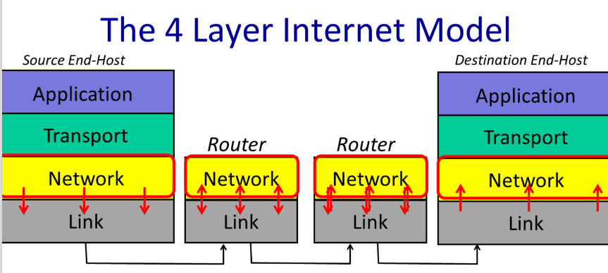

# Application Communication

## Connectivity

“The current exponential growth of the network seems to show that connectivity is its own reward, and it is more valuable than any individual application such as mail or the World-Wide Web.”

--- Dave Clark
(one of the key contributors to the Internet’s design, once wrote)

- Bidirectional, reliable byte stream
  - Building block of most applications today
  - Other models exist and are used, we’ll cover them later in the class
- Abstracts away entire network -- just a pipe between two programs
- Application level controls communication pattern and payloads
  - World Wide Web (HTTP)
  - Skype
  - BitTorrent

# 1.2 The structure of the Internet: 4 Layer Internet Model

- The Application layer: steam of data
  a stream of data from the application layer. this stream into segments of data that it reliably delivers to an application running on another computer.

- The Transport layer : segments of data
  The transport layer sends these segments as network layer packets, which the network layer delivers to the other computer.

- The Network layer: packets of data
  The Network layer sends these packets to the next hop router, which forwards them to the destination computer.


- The Internet is made up of end-hosts, links and routers.
- Data is delivered hop-by-hop over each link in turn.
- Data is delivered in packets.
- A packet consists of the data we want to be delivered, along with a header that tells the network where the packet is to be delivered, where it came from and so on.

## Link Layer

The Link Layer’s job is to carry the data over one link at a time.

- Ethernet and
- WiFi

## Network Layer

The network layer’s job is to deliver packets end-to-end across the Internet from the source to the destination.

A packet is an important basic building block in networks.

- a self-contained collection of data
- a header that describes what the data is, where it is going and where it came from.

### Network Layer Process



- The Network hands the datagram to the Link Layer below , telling it to send the datagram over the first link.
- the Link Layer says: “if you give me a datagram to send, I will transmit it over one link for you”
- The Link Layer of the router
  - accepts the datagram from the link, and hands it up to the Network Layer in the router.
  - The Network Layer on the router examines the destination address of the datagram, and is responsible for routing the datagram one hop at a time towards its eventual destination
  - It does this by sending to the Link Layer again, to carry it over the next link.
  - And so on until it reaches the Network Layer at the destination.

### Internet Protocol (IP)

The Internet Protocol (IP) is a protocol that is used to route packets from one network to another.

- IP makes a best-effort attempt to deliver our packets to the other end. But it makes no promises.
- IP packets can get lost, can be delivered out of order, and can be corrupted.There are no guarantees

## Transport Layer

### Transmission Control Protocol (TCP)

For now, the main thing to remember is that TCP provides a service to an application guaranteeing correct in-order delivery of data,running on top of the Network Layer service, which provides an unreliable datagram delivery service.

### User Datagram Protocol (UDP)

UDP just bundles up application data and hands it to the Network Layer for delivery to the other end. UDP offers no delivery guarantees.

## Application Layer

## The 7 lyaers of the OSI model


- When the transport layer has data to send, it hands a Transport Segment to the Network layer below. to drop transport segment into IP datagram
- The network layer puts the transport segement inside a new IP datagram. IP datagrams consist of a header and some data. IP’s job is to deliver the datagram to the other end.
- But first, the IP datagram has to make it over the first link to the first router， to put IP datagram inside Link frame， such as an Ethernet packet and ships it off to the first router.

# 1.3 The IP service model

### Properties

1. IP is a datagram service
   The datagram is a packet that is routed individually through 3
   the network based on the information in its header. In other words, the datagram is self-contained.

2. Unreliable
3. Best effort
4. IP is a connectionless service

### The IP service

1. IP tries to prevent packets from looping forever.

TTL field(Time To Live):  
It starts out at a number like 128 and then is decremented by every router it passes through. If it reaches zero, IP concludes that it must be stuck in a loop and the router drops the datagram

2. IP will fragment packets if they are too long.
3. IP uses a header checksum to reduce chances of delivering a datagram to the wrong destination.
4. two versions of IP in use today:
   - IPv4, It uses the 32bit addresses you are probably familiar with.
   - IPv6, which uses 128 bit addresses instead
5. IP allows new fields to be added to the
   datagram header

### IPv4-Datagram


- The Protocol ID
  that tells us what is inside the data field. Essentially, it allows the destination end host to demultiplex arriving packets, sending them to the correct code to process the packet.
  If the Protocol ID has the value “6” then it tells us the data contains a TCP Segment, and so we can safely pass the datagram to the TCP code and it will be able to parse the segment correctly.

  The Internet Assigned Numbers Authority (IANA) defines over 140
  different values of Protocol ID, representing different transport protocols.

- The Type of Service field
  gives a hint to routers about how important this packet is.

- The Checksum field
  is calculated over the whole header so just in case the header is corrupted, we are not likely to deliver a packet to the wrong desination by mistake.

# 1.4 Life of a Packet

## Three way handshake

the three way handshake is described as “synchronize,
synchronize and acknowledge, acknowledge”, or “SYN, SYN-ACK, ACK”.

1. SYN
   when the client sends a “synchronize” message to the server, often
   called a SYN.

2. SYN-ACK
   when the server responds with a “synchronize” message that also acknowledges the clients “synchronize”, or a “synchronize and acknowledge message”, often called a SYN-ACK.

3. ACK
   when the client responds by acknowledging the server’s synchronize, often called an ACK.

## TCP Byte Stream


1. an Internet Protocol address
   is the address the network layer uses to deliver packets to the computer.

2. the TCP port
   tells the computer’s software which application to deliver data to

Web servers usually run on TCP port 80. So when we open a connection to a web server, we send IP packets to the computer running the web server whose destination address is that computer’s IP address. Those IP packets have TCP segments whose destination port is 80.

### Inside each hop in router


How does a router make this decision?

- Forwarding table:

A forwarding table consists of a set of IP address patterns and the link to send across for each pattern

When a packet arrives, the router checks which forwarding table entry’s pattern best matches the packet. It forwards the packet along that entry’s link.

Generally, “best” means the most specific match. I’ll describe how this matching works in more detail in the video on longest prefix match.

## Under the Hood

1. Request web page from www.cs.brown.edu
   checke IP address with F12
2. Use wireshark to see TCP byte stream establishment and data exchange
3. Use traceroute to see route packets take through Internet

### wireshark

[网络顶级掠食者 Wireshark 抓包从入门到实战](https://www.bilibili.com/video/BV12X6gYUEqA/?spm_id_from=333.337.search-card.all.click&vd_source=b3d4057adb36b9b243dc8d7a6fc41295)

[www.wireshark.org](https://www.wireshark.org/download.html)

1. Request web page from www.cs.brown.edu

2. Open wireshark
   1. 选择 网卡
   2. filter:
      tcp.port == 80 && ip.addr == 128.148.32.12


[ssl-handshakes](https://www.ruanyifeng.com/blog/2014/09/illustration-ssl.html)

### traceroute

```bash
sudo apt install inetutils-traceroute
traceroute --version

# nslookup stands for "Name Server Lookup". It's a network administration command-line tool used to query the Domain Name System (DNS) to obtain domain name or IP address mapping information.
nslookup www.cs.brown.edu
# ;; Got recursion not available from 10.255.255.254
# Server:         10.255.255.254
# Address:        10.255.255.254#53

# Non-authoritative answer:
# Name:   www.cs.brown.edu
# Address: 128.148.32.12


traceroute www.cs.brown.edu
# traceroute www.csail.mit.edu

# traceroute to www.cs.brown.edu (128.148.32.12), 64 hops max
#   1   172.23.160.1  0.202ms  0.101ms  0.124ms
#   2   192.168.1.1  0.549ms  0.420ms  0.399ms
#   3   183.158.115.65  4.255ms  3.648ms  3.704ms
#   4   60.163.248.201  3.569ms  60.163.248.199  3.179ms  115.220.248.50  3.127ms
#   5   60.163.248.172  3.531ms  3.385ms  3.414ms
#   6   115.233.20.37  3.752ms  3.716ms  3.597ms
#   7   202.97.33.241  11.560ms  11.368ms  12.276ms
#   8   202.97.24.222  6.610ms  6.558ms  6.501ms
#   9   202.97.39.53  13.724ms  13.678ms  13.496ms
#  10   202.97.99.154  155.042ms  154.282ms  154.885ms
#  11   *


curl http://nginx.org/
3.125.197.172:80

```

# 1.6 Basic architectural ideas and principles

1. packet switching
   which is the simple way in which data is broken down into self-contained packets of information that are forwarded hop-by-hop based on the information in the packet header.

2. Layering

3. encapsulation
   which is the process of placing
   a packet processed at one layer inside the data of the
   packet below.

This helps a clear separation of concerns between how data is processed at each layer in the hierarchy.

# 1.5 Packet Switching

Packet:  
A self-contained unit of data that carries
information necessary for it to reach its destination.

Packet switching
is the idea that we break our data up into discrete, self-contained chunks of data. Each chunk, called a packet, carries sufficient information that a network can deliver the packet to its destination.

### two properties.

1. simple packet forwarding
   a switch can make individual, local decisions for each packet. It doesn’t need to keep extra state on the packets its seen or whether two packets go to the same destination.

#### No per-flow state required

Flow:

A collection of datagrams belonging to the same end-
to-end communication, e.g. a TCP connection.

2. a switch efficiently share a link between many parties.

### Memory, Byte Order, and Packet Formats

#### Endianness

How you lay out a multibyte value in memory is called endianness

- little endian:
  the least significant byte is at the lowest address.
  So the least significant byte comes first in memory. It turns out that from a computational and architectural standpoint, this can make the most sense.
- big endian:
  where the most significant byte is the lowest address. Big endian makes more sense to a human reader, because
  it’s how we write numbers, with the most significant digits first.

| Width | Decimal  | Binary    | Hexadecimal | Little Endian       | Big Endian          |
| ----- | -------- | --------- | ----------- | ------------------- | ------------------- |
| 16    | 1024     | 2^10      | 0x0400      | 0x00 0x04           | 0x04 0x00           |
| 16    | 53       |           | 0x0035      | 0x35 0x00           | 0x00 0x35           |
| 16    | 4116     | 4096 + 96 | 0x1014      | 0x14 0x10           | 0x10 0x14           |
| 32    | 5        |           | 0x00000005  | 0x05 0x00 0x00 0x00 | 0x00 0x00 0x00 0x05 |
| 32    | 83886080 |           |             |                     |

#### Network Byte Order

- Different processors have different endianness
- Little endian: x86,
- big endian: ARM
- To interoperate, they need to agree how to represent multi-byte fields
- Network byte order is big endian

```C
uint16_t val = 0x400;
uint8_t* ptr = (uint8_t*)&val;
if (ptr[0] == 0x40) {
   printf(“big endian\n”)
}
else if (ptr[1] == 0x40) {
   printf(“little endian\n”);
}
else {
   printf(“unknown endianness!\n”);
}
```

#### Portable Code

You have to convert network byte order values to your host order

```C
uint16_t http_port = 80; // host byte order

// network byte order vs host byte order
// Wrong
// if(packet->port== http_port){
// }

// ntohs: network to host short
// htons: host to network short
#include <arpa/inet.h>
uint16_t packet_port = ntohs(packet->port);
   if(packet_port== http_port){
      // OK
   }
```

#### Packet Formats


### Names and Addresses: IPv4

#### Address Structure

- Still assign contiguous ranges of addresses to nearby networks
  Class A, B, C is too coarse grained (e.g., MIT dorms!)
- http://news.stanford.edu/news/1999/january27/itss127.html

#### Address Structure Today: Classless Inter-Domain Routing (CIDR)

- Address block is a pair: address,count
- Counts are powers of 2, specify netmask length
- 171.64.0.0/16 means any address in the range 171.64.0.0 to 171.64.255.255
- A /24 describes 256 addresses, a /20 describes 4,096 addresses

## Longest Prefix Match

- Forwarding table is a set of CIDR entries
- An address might match multiple entries
  E.g., 171.33.0.1 matches both entries on right
- Algorithm: use forwarding entry with the longest matching prefix
  Longest prefix match will chose link 5 for 171.33.0.1

# 1.11 Address Resolution Protocol(ARP)

the mechanism by which the network layer can discover the link address associated with a network address it’s directly connected to.
Put another way, it’s how a device gets an answer to the question:
“I have an IP packet whose next hop is this address -- what link address should I send it to?”

### IP address & Link address

- IP address
  An IP address is a network-level address. It describes a host, a unique destination at the network layer.

- Link address

describes a particular network card, a unique device that sends and receives link layer frames.

Ethernet, for example, has 48 bit addresses. Whenever you buy an Ethernet card, it’s been
preconfigured with a unique Ethernet address.

So an IP address says “this host”, while an Ethernet address says “this Ethernet card.”

## ARP Properties

ARP is a simple request-reply protocol.

- Generates mappings between layer 2 and layer 3 addresses

  - Nodes cache mappings, cache entries expire
    Every node keeps a cache of mappings from IP addresses on its network to link layer addresses.

- Simple request-reply protocol
  - “Who has network address X?”
  - “I have network address X.”
- The response includes the link layer address.
  Request sent to link layer broadcast address

- Reply sent to requesting address (not broadcast)
- Packet format includes redundant data
  - Request has sufficient information to generate a mapping
  - Makes debugging much simpler
- No “sharing” of state: bad state will die eventually

## ARP Packet Format (RFC826)
