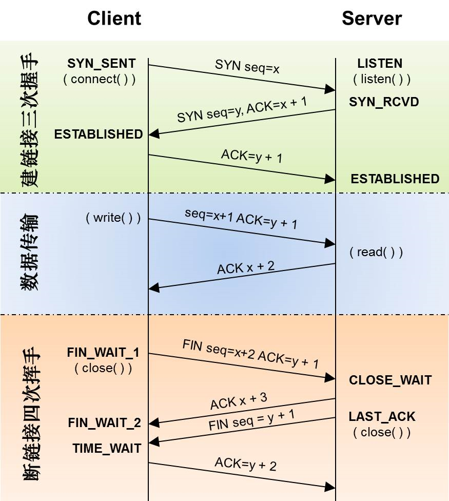
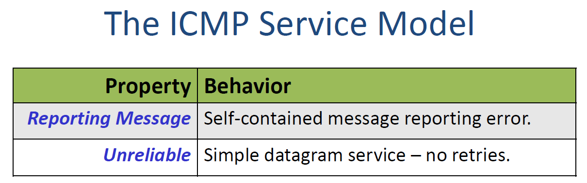

# 2.1 TCP service model




## The TCP connection 3 way handshake


- 1. SYN message
     Host A sends a message to B indicating that the TCP layer at A wants to establish a connection with the TCP layer at B.
     The message is called a SYN message, which is short for synchronize, because A also sends along the base number it will use to identify bytes in the byte stream.

  If it sends “0” then the numbers will start at zero. If it sends “1,000” then they will start at 1,000.

- 2. SYN + ACK
     B responds with what we call a SYN + ACK.
     B signals an ACK because B is acknowledging A’s request and agreeing to establish the communication from A to B.
     The TCP layer at B also sends a SYN back to A to indicate that the TCP layer at B wants to establish a connection with the TCP layer at A.
     It sends a number too, indicating the starting number for the byte stream.
- 3.ACK
  A responds with an ACK to indicate that it is accepting the request for communication in the reverse direction. The connection is now setup in both directions. They are now ready to start sending data to each other.

### Initial Sequence Number (ISN)

Each TCP side chooses its own random ISN during the handshake to prevent old data from being confused with new data (helps prevent replay attacks).

- In SYN segment: Sequence Number = ISN, no data yet.
- In ACK segment: Acknowledgment Number = ISN + 1.

## TCP connection teardown 4 way handshake


When A and B have finished sending data to each other, they need to close the connection. We say they “teardown” the connection, which means they tell each other they are closing the connection and both ends can clean up the state associated with the state machine.

1. FIN message
   The TCP layer at Host A can close the connection by sending a FIN message, which is short for FINISH.
2. ACK
   Host B acknowledges that A no longer has data to send and stops looking for new data from A. This closes down the data stream from A to B. But B might still have new data to send to A and is not ready to close down the channel from B to A. So the message from B to A carrying the ACK can also carry new data from B to A. B can keep sending new data to A as long as it needs to.
3. FIN
   Sometime later B finishes sending data to A, and now sends its own FIN to tell A they can close the connection.
4. ACK
   Host A replies by sending an ACK to acknowledge that the connection is now closed. Because both directions have finished, the connection is now fully closed and the state can be safely removed.

## TCP service model Properties


### Steam of Bytes

it provides a reliable stream of bytes between two applications.

### Reliable delivery

It uses four mechanisms to make the communication reliable – in other words, to make sure the data is correctly delivered.

1. When a TCP layer receives data, it sends an acknowledgment back to the sender to let it know the data arrived correctly.

2. Checksums detect corrupted data.
   The TCP header carries a checksum covering the header and the data inside the segment. The checksum is there to detect if the segment is corrupted along the way, for example by a bit-error on the wire or by a memory fault inside a router.

3. Sequence numbers detect missing data.
   Every segment’s header carries the sequence number - in the stream of bytes – of the first byte in the segment.
   For example, if the two sides agree that the sequence numbers start at 1,000 then the first segment will have a sequence number of 1,000. If the segment carries 500 bytes of data then the next segment will carry the sequence number 1,500. If a segment gets lost, then the sequence number will be incorrect and the TCP layer knows some data is missing. It is possible it will show up later – perhaps it took a longer path – or it might have gone missing, in which case the sender will need to resend the data.

4. Flow-control prevents overrunning the receiver.
   If Host A is much faster than Host B then it’s possible for Host A to overwhelm Host B by sending data so fast that Host B can’t keep up. TCP prevents this from happening using something we call flow-control. In TCP, the receiver keeps telling the sender if it can keep sending; specifically, it tells the sender how much room it has in its buffers to accept new data. If Host B is falling behind, the space drops – possibly all the way to zero. When it has more room, it tells A and it can send more data.

### In-sequence

TCP delivers data to the application in the right sequence; in other words, whatever sequence the data was delivered from the application to TCP at host A, this is the same order in which it is sent from TCP to the application at B. If segments arrive out of order, the TCP layer re-sequences them to the correct order, using the sequence number.

- TCP is a byte-oriented protocol, not message-oriented.
- Each byte of data sent over TCP is assigned a sequence number.
- The sequence number in the TCP header indicates "this is the number of the first byte in this segment".

### Congestion Control

TCP provides a service to the whole network by controlling congestion. TCP tries to divide up the network capacity equally among all the TCP connections using the network. The congestion control mechanisms in TCP are very complicated and we’ll devote the whole of Unit 4 to studying congestion control.

## TCP segment format


The TCP Segment header is much longer and more complicated than, say the IP and Ethernet headers. That is because a TCP connection is reliable – In order to make the communication reliable, the two ends of the connection need to exchange more information so they know which bytes have arrived, which are missing, and the status of the connection.
Here is a quick summary of the most important fields in the TCP header. You don’t need to remember the layout of the header, but you should learn what each field does. If you need a reference, I’d recommend Wikipedia or the Kurose and Ross textbook.

- Destination port
  The Destination port tells the TCP layer which application the bytes should be delivered to at the other end. When a new connection starts up, the application tells TCP which service to open a connection with.
  For example, if TCP is carrying web data, it uses port 80, which is the port number for TCP. You’ll learn more about port numbers later, but if you are curious, you can look up the well known port numbers at the IANA website. Search for IANA port numbers. You’ll find thousands of port numbers defined for different well known services.
  For example, when we open a connection to an ssh server, we use destination port 22.
  For smtp (the simple mail transfer protocol) we use port 23. Using a well known port number lets Host B identify the application it should establish the connection with.

- Source port:
  The Source port tells the TCP layer at the other end which port it should use to send data back again.
  In our example, when Host B replies to Host A, it should place Host A’s source port number in the destination port field, so that Host A’s TCP layer can deliver the data to the correct application. When a new connection starts, the initiator of the connection – in our case Host A – generates a unique source port number, so differentiate the connection from any other connections between Host A and B to the same service.

- Sequence number
  The Sequence number indicates the position in the byte stream of the first byte in the TCP Data field.

  For example, if the Initial Sequence number(ISN) (chosen by the sender) is 1,000 and this is the first segment, then the Sequence number is 1,000. If the sender want to send segment is 500 bytes long, then the sequence number in the next segment will be 1,500 and so on.

  | Segement | Sequence number | Payload Size | Next Sequence number |
  | -------- | --------------- | ------------ | -------------------- |
  | 1        | 1,000           | 500          | 1,500                |
  | 2        | 1,500           | 100          | 1,600                |
  | 3        | 1,600           | 500          | 2,100                |

- Acknowledgment sequence number
  The Acknowledgment sequence number tells the other end which byte we are expecting next. It also says that we have successfully received every byte up until the one before this byte number.

  For example, if the Acknowledgment Sequence number is 751, it means we have received every byte up to and including byte 750. Notice that there are sequence numbers for both directions in every segment. This way, TCP piggybacks acknowledgments on the data segments traveling in the other direction.

- checksum
  The 16 bit checksum is calculated over the entire header and data, and helps the receiver detect corrupt data. For example, bit errors on the wire, or a faulty memory in a router. You’ll learn more about error detection and checksums in a later video.

- Header Length
  The Header Length field tells us how long the TCP header is.

- TCP Options fields
  The TCP Options fields are, well, optional. They carry extra, new header fields that were thought of and added after the TCP standard was created. The Header Length field tells us how many option fields are present. Usually there are none.

- Flags
  Finally, there are a bunch of Flags used to signal information from one end of the connection to the other.
  - The ACK flag tells us that the Acknowledgement sequence number is valid and we are acknowledging all of the data up until this point.
  - The SYN flag tells us that we are signalling a synchronize, which is part of the 3way handshake to set up the connection.
  - the FIN flag signals the closing of one direction of the connection.
  - the PSH flag tells the TCP layer at the other end to deliver the data immediately upon arrival, rather than wait for more data. This is useful for short segments carrying time critical data, such as a key stroke. We don’t want the TCP layer to wait to accumulate many keystrokes before delivering them to the application.

### TCP connection Unique ID


A TCP connection is uniquely identified by five pieces of information in the TCP and IP headers.

- The IP source and destination addresses uniquely identify the end points
- the IP Protocol ID for TCP tells us the connection is TCP.
- The TCP source and destination ports identify they application processes on the end hosts

### Sequence numbers


A TCP sequence number is a 32-bit number that uniquely identifies the position of the first byte of data in a TCP segment within the overall data stream.

- The sequence number in a segment from A to B includes the sequence number of the first byte, offset by the initial sequence number.
- The acknowledgment sequence number in the segment from B back to A tells us which byte B is expecting next, offset by A’s initial sequence number.

#### Why do we need it?

- Ordering: Helps the receiver put segments back in the correct order.
- Reliability: Allows the receiver to detect missing segments and ask for retransmission (via ACKs).
- Flow Control: In combination with acknowledgment numbers and window sizes, it helps manage data flow.

### TCP Port Demultiplexing


# 2.2 User Datagram Protocol(UDP) Service Model

UDP is used by applications that don’t need the guaranteed delivery service of TCP

- either because the application handles retransmissions in its own private way,
- or because the application just doesn’t need reliable delivery

## UDP datagram format


## UDP Port demultiplexing


## UDP Property


# 2.3 The Internet Control Message Protocol (ICMP) Service Model

Making the Network Layer Work

1. The Internet Protocol (IP)
   -The creation of IP datagrams.
   -Hop-by-hop delivery from end to end.

2. Routing Tables

- Algorithms to populate router forwarding tables

3. Internet Control Message Protocol (ICMP)

- Communicates network layer information between end hosts and routers
- Reports error conditions
- Helps us diagnose problems

## ICMP Property



## ICMP Message Types


## How ping uses ICMP

The ping command is a diagnostic tool that uses the ICMP protocol to test whether a network host is reachable and how long it takes for packets to travel between two hosts.

ping sends ICMP Echo Request messages and waits for ICMP Echo Reply messages.

### Ping process:

- You run ping example.com
- Your system resolves example.com to an IP address.
- It sends an ICMP Echo Request packet to that IP.
- The destination host receives it and responds with an ICMP Echo Reply.
- ping calculates the round-trip time (RTT) and shows you the result.

### What’s inside an ICMP Echo packet?

Each packet includes:

- Type and code (e.g., Type 8 for Echo Request)
- Identifier (usually a process ID)
- Sequence number (for ordering and matching)
- Payload (some data for RTT calculation)

### ICMP Message Types Used by Ping

| ICMP Type | Message Name | Direction      |
| --------- | ------------ | -------------- |
| 8         | Echo Request | Sent by ping   |
| 0         | Echo Reply   | Sent by target |

### Example

```bash
$ ping google.com

PING google.com (142.250.4.78): 56 data bytes
64 bytes from 142.250.4.78: icmp_seq=0 ttl=115 time=14.3 ms
64 bytes from 142.250.4.78: icmp_seq=1 ttl=115 time=13.8 ms
```

icmp_seq: matches the ICMP sequence number

ttl: time-to-live (how many hops left)

time: round-trip time in milliseconds

### What if no reply?

If there is no response, ping will show Request timeout, which could mean:

Host is unreachable

ICMP is blocked by a firewall

The target doesn't respond to ICMP Echo Requests

## How traceroute uses ICMP

traceroute shows the path that packets take from your computer to a destination host, hop-by-hop.

Each “hop” is typically a router that forwards the packet toward the destination. traceroute figures this out by manipulating the TTL (Time-To-Live) field in the IP header.

### How Does It Work?

Here’s the high-level mechanism:

1. traceroute sends packets with a TTL = 1, then TTL = 2, and so on.
2. When a router receives a packet:

- It decrements the TTL.
- If TTL becomes 0, it discards the packet and sends back an ICMP "Time Exceeded" (Type 11) message to the sender.

3. traceroute uses the returned ICMP messages to:

- Learn the IP address of each hop
- Measure the round-trip time to each hop

4. When the packet finally reaches the destination, the destination host responds with either:

- An ICMP "Port Unreachable" (if UDP is used),
- Or an ICMP Echo Reply (if ICMP is used, like on Windows),
- Or nothing at all if ICMP is blocked.

### Example

```bash
$ traceroute google.com

1  192.168.1.1 (192.168.1.1)  1.123 ms  1.032 ms  0.991 ms
2  10.10.0.1 (10.10.0.1)     5.237 ms  5.412 ms  5.389 ms
3  172.217.0.1 (172.217.0.1) 15.332 ms 14.988 ms 15.102 ms
...

```

### ICMP Messages Used Internally

| ICMP Type | Meaning                 | When It's Seen                              |
| --------- | ----------------------- | ------------------------------------------- |
| 11        | Time Exceeded           | When TTL expires at a router                |
| 3         | Destination Unreachable | When packet reaches host but port is closed |
| 0         | Echo Reply              | When using ICMP Echo (like on Windows)      |

# 2.5 Error Detection:


- Ethernet appends a cyclic redundancy code
- Transport Layer Security appends a message authentication code
- IP prepends a checksum, which it places in the IP header.

  TLS and Ethernet have a footer, protocol information which follows the payload, which is where they put the CRC and MAC.

### Three Error Detection Schemes

- Checksum adds up values in packet (IP, TCP)
  - Very fast, cheap to compute even in software
  - Not very robust
- Cyclic redundancy code computes remainder of a polynomial (Ethernet)
  - More expensive than checksum (easy today, easy in hardware)
  - Protects against any 2 bit error, any burst ≤ c bits long, any odd number of errors
- Message authentication code: cryptographic transformation of data (TLS)
  - Robust to malicious modifications, but not errors
  - If strong, any 2 messages have a 2-c chance of having the same code
- Each layer has its own error detection: end-to-end principle!

## IP Checksum

- IP, UDP, and TCP use one’s complement checksum algorithm:

  - Set checksum field to 0, sum all 16-bit words in packet
  - Add any carry bits back in: 0x8000 + 0x8000 = 0x0001
  - Flip bits (0xc379 becomes 0x3c86), unless 0xffff, then checksum is 0xffff
  - To check:
    It comes naturally from one’s complement logic (sum + flipped sum = all 1s)
    sum whole packet, including checksum, should be 0xffff

- Benefits: fast, easy to compute and check

  - Motivated by earliest software implementations

- Drawbacks: poor error detection
  - Only guarantees detecting a single bit error
  - Can detect other errors, but actual guarantees are both weak and complex

```yaml
# Suppose a TCP segment has this payload:
"hello"

# ASCII codes:
'h' = 0x68
'e' = 0x65
'l' = 0x6C
'l' = 0x6C
'o' = 0x6F

#  if you have a stream of bytes like:
# The Internet is big-endian for checksum purposes: most significant byte comes first.
[0x68, 0x65, 0x6C, 0x6C, 0x6F]

# We group it into 16-bit words (pad last byte if odd number):
# If the total number of bytes is odd, a 0x00 byte is added at the end for alignment.
0x6865
0x6C6C
0x6F00   ← padded with 0

Now we can apply the checksum algorithm using these 16-bit words.
```

```C++
/**
 * In one’s complement,
 * - the negative of a number is represented by flipping all the bits (i.e., bitwise NOT)
 * - Addition rule: Binary add + wrap-around carry
 * - Zero representation: +0 and -0 (both exist)
*/

u_short
cksum(u_short *buf, int count)
{
    register u_long sum = 0;

    while (count--)
    {
        sum += *buf++;
        if (sum & 0xFFFF0000)
        {
            /* carry occurred(overflow), so wrap around */
            sum &= 0xFFFF;
            sum++;
        }
    }
    return ~(sum & 0xFFFF);
}

```

## Cyclic Redundancy Check (CRC)

### Intuition Behind CRC

Think of CRC like a smart remainder you get when dividing your data (viewed as a big binary number) by another fixed binary number (called the generator polynomial). This remainder is appended to the message.

When the receiver gets the message:

1. It divides the whole message (including the CRC bits) by the same generator.
2. If the remainder is zero, the message is assumed to be correct.

If an error has occurred during transmission, the remainder will (almost always) be non-zero, and the receiver knows the data is corrupted.

### How CRC Works (High-Level)

Sender side:

- Treat the data as a binary number.
- Append n zero bits (where n = degree of generator polynomial).
- Divide this by the generator polynomial (using modulo-2 division).
- The remainder is the CRC code.
- Append this CRC to the original data.

Receiver side:

- Divide the entire received message (data + CRC) by the same generator.
- If the remainder is zero, assume no error. Else, error is detected.

### CRC Property

- Cyclic Redundancy Check (CRC): distill n bits of data into c bits, c ≪ n

  - Can’t detect all errors:2^-c chance another packet’s CRC matches

- CRC designed to detect certain forms of errors: stronger than checksum

  - Any message with an odd number of bit errors
  - Any message with 2 bits in error
  - Any message with a single burst of errors ≤ c bits long

- Link layers typically use CRCs
  - Fast to compute in hardware (details in a moment)
  - Can be computed incrementally
  - Good error detection for physical layer burst errors

### Diversion: CRC Mathematical Basis

- Cyclic Redundancy Check (CRC): distill n bits of data into c bits, c << n
- Uses polynomial long division
  - Consider the message M a polynomial with coefficients 0 or 1 (pad with c zeroes)
    - E.g., M = 10011101 = x^7 + x^4 + x^3 + x^2 + 1
  - Use a generator polynomial G of degree c also with coefficients 0 or 1 (binary polynomia)
    - Pad first term (always 1) for frustrating historical reasons
    - E.g. G = 1011 = x^4 + x^3 + x + 1
    - USB (CRC-16) = 0x8005 = x^16 + x^15 + x^2 + 1
  - Divide M by G, the remainder is the CRC: pick G carefully!
- Append CRC to message M: M’ = M + CRC
  - Long division of M’ with G has a remainder of 0

## MAC

A MAC is like a secure fingerprint attached to a message.
It tells the receiver:

- “This message has not been changed”
- “It was created by someone who knows the secret key”

### How it works:

1. Sender and receiver share a secret key.
2. The sender computes a MAC tag using:

- the message content
- the secret key

3. The MAC tag is sent with the message.

4. The receiver:

- recomputes the MAC using the same secret key and received message
- compares it with the tag that came along
- if they match → message is valid!

### MAC Property

- Message Authentication Code (MAC)
  - Not to be confused with Media Access Control (MAC)!
- Uses cryptography to generate c = MAC(M, s), |c| ≪ |M|
  - Using M and secret s, can verify c = MAC(M, s)
  - If you don’t have s, very very hard to generate c
  - Very very hard to generate an M whose MAC is c
  - M + c means the other person probably has the secret (or they’re replayed!)
- Cryptographically strong MAC means flipping one bit of M causes every bit
  in the new c to be randomly 1 or 0 (no information) - Not as good for error detection as a CRC! - But protects against adversaries

### Common MAC algorithms:

- HMAC (based on hash functions like SHA-256)
- CMAC (based on block ciphers like AES)

# 2.6 Finite State Machines

## FSM Example: HTTP Request

So let’s walk through an example, an HTTP request. In practice HTTP requests are a bit more complex than this, there all kinds of options, so for this example we’ll just use a very simple form.
Let’s describe our system this way. 


So here we have a three state system. 
- Idle 
- Page requesting state
- Request pending state

Idele State -> Page requesting state ->  Request pending state

1. Idele State 
   
- In our starting state we are are viewing a page or otherwise idle.

2. Page requesting state
   
- When we want to load a new page, we transition to the page requesting state.
So the event is load new page, and the action is open a connection to the web server. 

3. Idele State:
   
- Once we’ve opened a connection, we’re now in the page requesting state. We’ll transition back to the idle state when the connection closes or when we finish requesting every resource on the page.

4. Request pending state
We need one more state, which describes where we are in requesting a page. On the event of having more resources to request, we take the action of requesting a resource with an HTTP GET. This puts us in the request pending state. 

5. Page requesting state
On the event of receiving the response, our system transitions back to the page requesting state.


On one hand, this is a nice, simple FSM. But if you were to try to implement it, it leaves a lot unsaid. Specifically, we have 4 events in the system: 

- page request
- more requests
- receive response
- connection closed. 
  
So what happens if the connection closes when we’re in the request pending state? 
Or when we receive a page request while in the page requesting state? 
Or receive response while in the idle state?


## FSM Example: TCP Connection

[TCP State Diagram](https://en.wikipedia.org/wiki/Transmission_Control_Protocol#Protocol_operation)


### TCP Connection State

[TCP Connection state](https://maxnilz.com/docs/004-network/003-tcp-connection-state/)

| State | Endpoint | Description |
|-------|----------|-------------|
| CLOSED | Server and client | No connection state at all |
| LISTEN | Server | Waiting for a connection request from any remote TCP end-point |
| SYN-SENT | Client | Waiting for a matching connection request after having sent a connection request |
| SYN-RECEIVED | Server | Waiting for a confirming connection request acknowledgment after having both received and sent a connection request |
| ESTABLISHED | Server and client | An open connection, data received can be delivered to the user. The normal state for the data transfer phase of the connection |
| FIN-WAIT-1 | Server and client | Waiting for a connection termination request from the remote TCP, or an acknowledgment of the connection termination request previously sent |
| FIN-WAIT-2 | Server and client | Waiting for a connection termination request from the remote TCP |
| CLOSING | Server and client | Waiting for a connection termination request acknowledgment from the remote TCP |
| TIME-WAIT | Server or client | Waiting for enough time to pass to be sure that all remaining packets on the connection have expired |
| CLOSE-WAIT | Server and client | Waiting for a connection termination request from the local user |
| LAST-ACK | Server and client | Waiting for an acknowledgment of the connection termination request previously sent to the remote TCP (which includes an acknowledgment of its connection termination request) |
| CLOSED | Server and client | No connection state at all |


 
So let’s walk through a real example of an FSM, probably the most famous FSM in the Internet. This
diagram here describes the finite state machine of TCP. 
it has 12 states -- but I’ll walk though it bit by bit and you’ll see how it all fits together.

First off, the diagram really has four parts, which we can look at separately. These top 4 states are what
describe how you open a TCP connection. 

- ESTABLISHED state  
  This center state, “ESTABLISHED” is when TCP is sending and receiving data. 
  It’s after the connection has been established but before it’s been closed. 

- CLOSED State  
  These 6 states describe how connections close. 
  This state at the bottom, CLOSED, denotes the connection has closed and the node can forget about it. 

- CLOSING State  
  Note that the top state is also the closed state -- before we open the connection.


### TCP three-way handshake

Recall that you start a TCP connection with a three way handshake -- SYN, SYN/ACK, ACK. The client, or
active opener, sends a SYN, synchronization, message to a program listening for connection requests.
When it receives a SYN, it responds with a SYN/ACK, synchronizing and acknowledging the original synchronization. The active opener, on receiving the SYN/ACK, responds with an acknowledgement.

The state diagram here describes how TCP behaves on both sides of the TCP three-way handshake. 

- Server： Listen state  
A passive opener is a server. It listens for requests for connections from active openers, clients. So when a program calls listen(), the socket transitions from the orange closed state to the yellow listen state. 

The protocol takes no actions when this happens -- it doesn’t send any messages. If the server calls close on the socket when it’s in the listen state, it transitions immediately to the closed state.

- Client: Close State -> SYN SENT state  
Let’s walk through the three way handshake starting with the first step, when a client tries to open a connection and sends a SYN packet to the server.
We can see this first transition for the client side of the connection as this orange arrow from closed to the SYN SENT state. This happens when the client program calls connect -- the event -- and the client sends a SYN message.
So once the first SYN is sent, the client is in the SYN SENT state and the server is in the LISTEN state. 

- Server : Listen state -> SYN RECEIVED state  
When the SYN arrives at the server, this leads to this
blue transition. You can see the event is receiving a SYN message. The action is to send a SYN/ACK message in response. Now the server is in the SYN RECEIVED state.

- Client : SYN SENT -> ESTABLISHED  
Let’s jump back to the client. Remember, it was in the SYN SENT stage. Now, when it receives the SYN/ACK from the server, it transitions to the ESTABLISHED state. 
Its action is to send an ACK message, the third message of the SYN, SYN/ACK, ACK handshake. Now the client can start sending data to the server.

- Server : SYN RECEIVED -> ESTABLISHED
Finally, let’s go back to the server, which is in the SYN RECEIVED state. When it receives the ACK from the client, it transitions to the ESTABLISHED state and can send data.
There are a couple more transitions during connection opening


# 2.7  Flow Control

## Stop-and-Wait
