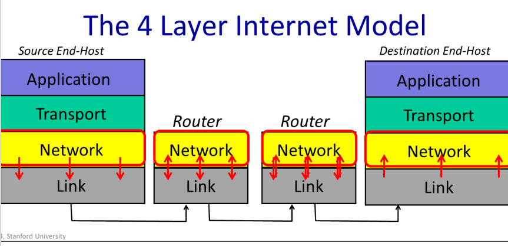
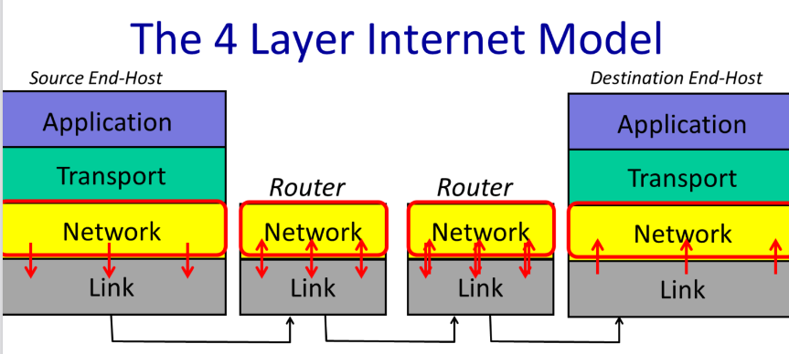
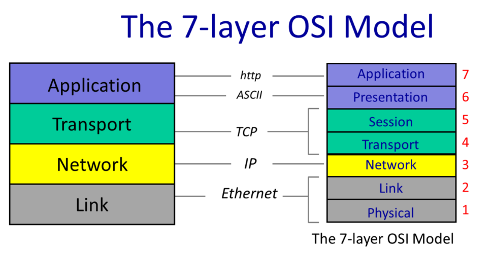
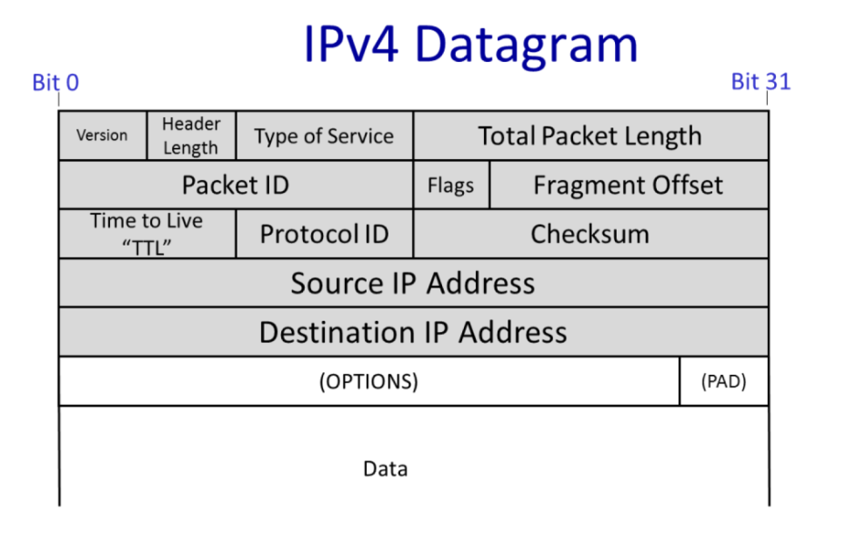
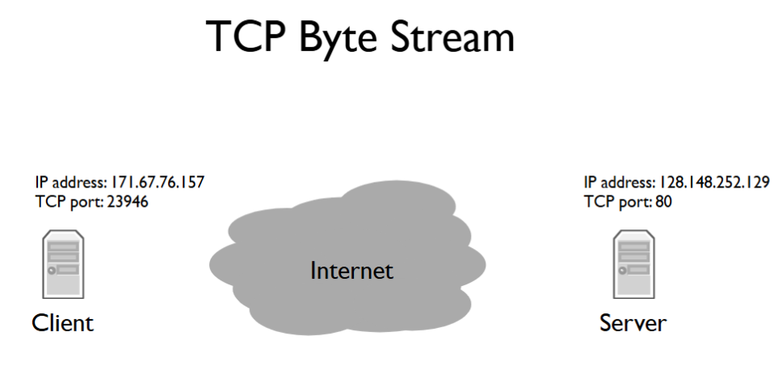
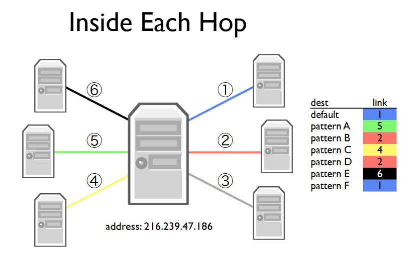

# Application Communication

## Connectivity

“The current exponential growth of the network seems to show that connectivity is its own reward, and it is more valuable than any individual application such as mail or the World-Wide Web.”

--- Dave Clark
(one of the key contributors to the Internet’s design, once wrote)

- Bidirectional, reliable byte stream
  - Building block of most applications today
  - Other models exist and are used, we’ll cover them later in the class
- Abstracts away entire network -- just a pipe between two programs
- Application level controls communication pattern and payloads
  - World Wide Web (HTTP)
  - Skype
  - BitTorrent

# 1.2 The structure of the Internet: 4 Layer Internet Model

- The Application layer: steam of data
  a stream of data from the application layer. this stream into segments of data that it reliably delivers to an application running on another computer.

- The Transport layer : segments of data
  The transport layer sends these segments as network layer packets, which the network layer delivers to the other computer.

- The Network layer: packets of data
  The Network layer sends these packets to the next hop router, which forwards them to the destination computer.



- The Internet is made up of end-hosts, links and routers.
- Data is delivered hop-by-hop over each link in turn.
- Data is delivered in packets.
- A packet consists of the data we want to be delivered, along with a header that tells the network where the packet is to be delivered, where it came from and so on.

## Link Layer
deliver data over a single link between an end-host and router, or between routers.

The Link Layer’s job is to carry the data over one link at a time.
- Ethernet and
- WiFi

## Network Layer

The network layer’s job is to deliver packets end-to-end across the Internet from the source to the destination.

A `packet` is an important basic building block in networks.

- data: a self-contained collection of data
- header: a header that describes what the data is, where it is going and where it came from.

### Network Layer Process

- deliever datagram end-to-end, Best-effort delivery-no guarantees.
- must use the Internet Protocol (IP)



- The Network hands the `datagram` to the Link Layer below , telling it to send the datagram over the first link.
- the Link Layer says: “if you give me a datagram to send, I will transmit it over one link for you”
- The Link Layer of the router
  - accepts the `datagram` from the link, and hands it up to the Network Layer in the router.
  - The Network Layer on the router examines the destination address of the datagram, and is responsible for routing the datagram one hop at a time towards its eventual destination
  - It does this by sending to the Link Layer again, to carry it over the next link.
  - And so on until it reaches the Network Layer at the destination.

### Internet Protocol (IP)

The Internet Protocol (IP) is a protocol that is used to route packets from one network to another.

- IP makes a best-effort attempt to deliver our packets to the other end. But it makes no promises.
- IP packets can get lost, can be delivered out of order, and can be corrupted.There are no guarantees


## Transport Layer

- gurantees correct in-order delivery of data end-to-end.
- control congestion

### Transmission Control Protocol (TCP)

For now, the main thing to remember is that TCP provides a service to an application guaranteeing correct in-order delivery of data,running on top of the Network Layer service, which provides an unreliable datagram delivery service.

### User Datagram Protocol (UDP)

UDP just bundles up application data and hands it to the Network Layer for delivery to the other end. UDP offers no delivery guarantees.

## Application Layer

bi-directional reliable byte stream between two applications, using application-specific protocols.(e.g. http, bit-torrent)


## Summary
## IP is the "thin waist"


### The 7 lyaers of the OSI model



- When the transport layer has data to send, it hands a Transport Segment to the Network layer below. to drop transport segment into IP datagram
- The network layer puts the transport segement inside a new IP datagram. IP datagrams consist of a header and some data. IP’s job is to deliver the datagram to the other end.
- But first, the IP datagram has to make it over the first link to the first router， to put IP datagram inside Link frame， such as an Ethernet packet and ships it off to the first router.

# 1.3 The IP service model

## Properties

1. IP is a datagram service
   The datagram is a packet that is routed individually through the network based on the information in its header. In other words, the datagram is self-contained.
   - Individually routed packets
   - hop-by-hop routing

2. Unreliable: Packets might be dropped

3. Best effort: iut only if nessesary
4. IP is a connectionless service
   No per-flow state
   Packets might be mis-sequenced


### Why the IP Service is So Simple?

The IP service model was designed with simplicity as a core principle for several interconnected reasons:

1. Network Simplicity and Cost Efficiency
- **Keep network infrastructure "dumb" and minimal** - This approach enables faster development, streamlined operations, and lower maintenance costs
- **Hardware optimization** - Simple network components can be implemented using dedicated hardware for high-speed operation
- **Reliability through simplicity** - Fewer complex components in distributed routers lead to more reliable and affordable systems that require less frequent upgrades

2. End-to-End Principle Implementation
- **Feature placement at endpoints** - The design philosophy emphasizes implementing intelligence at source and destination computers rather than in the network itself
- **Application-specific optimization** - Features like reliable communication and congestion control are handled by end hosts, allowing for correct implementation tailored to specific applications
- **Evolution flexibility** - Software-based implementations on end computers are easier to update and improve compared to network-hardcoded features
- **Radical departure from traditional models** - This contrasts with telephone systems that relied on simple endpoints and complex network switches

3. Flexibility for Diverse Application Needs
- **Application-controlled reliability** - Different applications can implement their own reliability mechanisms based on specific requirements
- **Real-time application support** - Services like video chat benefit from this approach since retransmitted packets might arrive too late to be useful
- **Custom service selection** - Applications can choose whether they need reliable or unreliable transmission based on their operational needs

4. Universal Link Layer Compatibility
- **Minimal assumptions about underlying technology** - IP works with both wired and wireless connections without requiring specific link-layer capabilities
- **Network agnostic design** - The protocol makes few demands on the link layer regarding retransmission or congestion control
- **Interconnection focus** - Designed specifically to interconnect existing diverse networks, reflecting its origin as the "Internet" (inter-networking)

This simple design philosophy has enabled IP to become the robust foundation for the modern internet while maintaining compatibility across diverse networking technologies and application requirements.

## The IP service Features 

1. Loop Prevention with TTL Field(Time To Live)
- Purpose: Prevents packets from looping infinitely in the network
- Mechanism: Uses a Time To Live (TTL) field in the datagram header that starts at a value like 128 and then is decremented by every router it passes through. If it reaches zero, IP concludes that it must be stuck in a loop and the router drops the datagram

- Operation: Each router decrements the TTL by 1; if it reaches zero, the packet is dropped as it's considered stuck in a loop
- Design philosophy: Simple mechanism that limits damage from looping packets without preventing loops entirely


2. IP will fragment packets if they are too long.

- Purpose: Handles packets that exceed link-specific size limitations
- Problem addressed: Different network links have varying maximum packet sizes (e.g., Ethernet: 1500 bytes)
- Solution: Routers can fragment oversized datagrams into smaller ones with appropriate header fields
- Reassembly: Destination hosts receive information needed to properly reassemble the original data


3. IP uses a header checksum to reduce chances of delivering a datagram to the wrong destination.
- Purpose: Reduces chances of delivering datagrams to incorrect destinations due to header corruption
- Implementation: Includes a checksum field calculated over the entire header
- Security aspect: Helps prevent accidental misdelivery that could cause security problems


4. Allow for new IP versions 
- IPv4: Current dominant version using 32-bit addresses (~90% of end hosts)
- IPv6: Transition version using 128-bit addresses to address IPv4 address exhaustion
- Flexibility: Supports gradual migration between versions as the Internet evolves


5. Extensible Header Options
- Capability: Allows new fields to be added to the datagram header beyond the standard format
- Advantages: Enables new features that weren't included in the original specification
- Disadvantages: May add processing overhead to routers, potentially conflicting with the goal of simplicity
- Usage: Very few options are commonly used or processed by routers in practice

## IPv4-Datagram



Here's a summary of the IPv4 header fields and their purposes:

**Essential Fields (the "big three"):**
1. **Destination IP Address** - Where the packet is going
2. **Source IP Address** - Where the packet came from
3. **Protocol ID** - What's inside the data field (e.g., "6" = TCP segment);  
   Essentially, it allows the destination end host to demultiplex arriving packets, sending them to the correct code to process the packet.
  Ex: If the Protocol ID has the value “6” then it tells us the data contains a TCP Segment, and so we can safely pass the datagram to the TCP code and it will be able to parse the segment correctly.
  **The Internet Assigned Numbers Authority (IANA)** defines over 140 different values of Protocol ID, representing different transport protocols.


**Version and Size Fields:**
1. **Version** - Identifies IP version (IPv4 or IPv6)
2. **Total Packet Length** - Up to 64k Bytes (header + data)
3. **Header Length** - Size of the header (varies due to optional fields)

**Reliability and Control Fields:**
7. **Time to Live (TTL)** - Decremented by each router; packet dropped when it reaches zero, preventing infinite loops
8. **Checksum** - Validates header integrity to avoid misdelivery due to corruption

**Fragmentation Fields:**
9. **Packet ID, Flags, and Fragment Offset** - Allow routers to break packets into smaller pieces when needed for links with smaller maximum sizes

**Quality of Service:**
10. **Type of Service** - Hints to routers about packet importance/priority

The key takeaway: IP is deliberately simple. It provides best-effort delivery with minimal guarantees—just basic addressing, demultiplexing, and some mechanisms to prevent disasters like infinite loops.


- The Type of Service field
  gives a hint to routers about how important this packet is.

- The Checksum field
  is calculated over the whole header so just in case the header is corrupted, we are not likely to deliver a packet to the wrong desination by mistake.

# 1.4 Life of a Packet


## TCP Byte Stream



**Two-Level Addressing:**
To deliver data to applications (not just computers), two addresses are needed:
1. **Internet Protocol(IP) Address** - Network layer uses this to deliver packets to the destination computer
2. **TCP Port** - Transport layer uses this to deliver data to the correct application on that computer

Example: Web servers typically run on **TCP port 80**, 
So when we open a connection to a web server, we send IP packets to the computer running the web server whose destination address is that computer’s IP address. Those IP packets have TCP segments whose destination port is 80.
so connections to web servers use the server's IP address plus destination port 80.

**TCP Connection Establishment - Three-Way Handshake:**
1. **SYN** - Client sends a "synchronize" message to the server
2. **SYN-ACK** - when the server responds with a “synchronize” message that also acknowledges the clients “synchronize”, or a “synchronize and acknowledge message”
3. **ACK** - Client acknowledges the server's synchronize

This three-message exchange opens a connection between client and server.

**Packet Routing:**
- Clients and servers aren't directly connected; packets travel through intermediate routers
- Each link between routers is called a **hop**
- Routers forward packets along their links, deciding which link to use for each arriving packet
- Routers can also deliver packets to their own software (e.g., when you log into the router itself)

**Key Insight:** The network layer (IP) delivers to computers, while the transport layer (TCP) delivers to applications within those computers.


### Inside each hop in router



How does a router make this decision?

- Forwarding table:

A forwarding table consists of a set of IP address patterns and the link to send across for each pattern

When a packet arrives, the router checks which forwarding table entry’s pattern best matches the packet. It forwards the packet along that entry’s link.

Generally, “best” means the most specific match. I’ll describe how this matching works in more detail in the video on longest prefix match.


## Under the Hood

1. Request web page from www.cs.brown.edu
   checke IP address with F12
2. Use wireshark to see TCP byte stream establishment and data exchange
3. Use traceroute to see route packets take through Internet

### wireshark

[网络顶级掠食者 Wireshark 抓包从入门到实战](https://www.bilibili.com/video/BV12X6gYUEqA/?spm_id_from=333.337.search-card.all.click&vd_source=b3d4057adb36b9b243dc8d7a6fc41295)

[www.wireshark.org](https://www.wireshark.org/download.html)

1. Request web page from www.cs.brown.edu

2. Open wireshark
   1. 选择 网卡
   2. filter:
      tcp.port == 80 && ip.addr == 128.148.32.12


[ssl-handshakes](https://www.ruanyifeng.com/blog/2014/09/illustration-ssl.html)

### traceroute

```bash
sudo apt install inetutils-traceroute
traceroute --version

# nslookup stands for "Name Server Lookup". It's a network administration command-line tool used to query the Domain Name System (DNS) to obtain domain name or IP address mapping information.
nslookup www.cs.brown.edu
# ;; Got recursion not available from 10.255.255.254
# Server:         10.255.255.254
# Address:        10.255.255.254#53

# Non-authoritative answer:
# Name:   www.cs.brown.edu
# Address: 128.148.32.12


traceroute www.cs.brown.edu
# traceroute www.csail.mit.edu

# traceroute to www.cs.brown.edu (128.148.32.12), 64 hops max
#   1   172.23.160.1  0.202ms  0.101ms  0.124ms
#   2   192.168.1.1  0.549ms  0.420ms  0.399ms
#   3   183.158.115.65  4.255ms  3.648ms  3.704ms
#   4   60.163.248.201  3.569ms  60.163.248.199  3.179ms  115.220.248.50  3.127ms
#   5   60.163.248.172  3.531ms  3.385ms  3.414ms
#   6   115.233.20.37  3.752ms  3.716ms  3.597ms
#   7   202.97.33.241  11.560ms  11.368ms  12.276ms
#   8   202.97.24.222  6.610ms  6.558ms  6.501ms
#   9   202.97.39.53  13.724ms  13.678ms  13.496ms
#  10   202.97.99.154  155.042ms  154.282ms  154.885ms
#  11   *


curl http://nginx.org/
3.125.197.172:80

```

# 1.6 Basic architectural ideas and principles

1. packet switching
   which is the simple way in which data is broken down into self-contained packets of information that are forwarded hop-by-hop based on the information in the packet header.

2. Layering

3. encapsulation
   which is the process of placing
   a packet processed at one layer inside the data of the
   packet below.

This helps a clear separation of concerns between how data is processed at each layer in the hierarchy.

# 1.5 Packet Switching

Packet:  
A self-contained unit of data that carries
information necessary for it to reach its destination.

Packet switching
is the idea that we break our data up into discrete, self-contained chunks of data. Each chunk, called a packet, carries sufficient information that a network can deliver the packet to its destination.

### two properties.

1. simple packet forwarding
   a switch can make individual, local decisions for each packet. It doesn’t need to keep extra state on the packets its seen or whether two packets go to the same destination.

#### No per-flow state required

Flow:

A collection of datagrams belonging to the same end-
to-end communication, e.g. a TCP connection.

2. a switch efficiently share a link between many parties.

### Memory, Byte Order, and Packet Formats

#### Endianness

How you lay out a multibyte value in memory is called endianness

- little endian:
  the least significant byte is at the lowest address.
  So the least significant byte comes first in memory. It turns out that from a computational and architectural standpoint, this can make the most sense.
- big endian:
  where the most significant byte is the lowest address. Big endian makes more sense to a human reader, because
  it’s how we write numbers, with the most significant digits first.

| Width | Decimal  | Binary    | Hexadecimal | Little Endian       | Big Endian          |
| ----- | -------- | --------- | ----------- | ------------------- | ------------------- |
| 16    | 1024     | 2^10      | 0x0400      | 0x00 0x04           | 0x04 0x00           |
| 16    | 53       |           | 0x0035      | 0x35 0x00           | 0x00 0x35           |
| 16    | 4116     | 4096 + 96 | 0x1014      | 0x14 0x10           | 0x10 0x14           |
| 32    | 5        |           | 0x00000005  | 0x05 0x00 0x00 0x00 | 0x00 0x00 0x00 0x05 |
| 32    | 83886080 |           |             |                     |

#### Network Byte Order

- Different processors have different endianness
- Little endian: x86,
- big endian: ARM
- To interoperate, they need to agree how to represent multi-byte fields
- Network byte order is big endian

```C
uint16_t val = 0x400;
uint8_t* ptr = (uint8_t*)&val;
if (ptr[0] == 0x40) {
   printf(“big endian\n”)
}
else if (ptr[1] == 0x40) {
   printf(“little endian\n”);
}
else {
   printf(“unknown endianness!\n”);
}
```

#### Portable Code

You have to convert network byte order values to your host order

```C
uint16_t http_port = 80; // host byte order

// network byte order vs host byte order
// Wrong
// if(packet->port== http_port){
// }

// ntohs: network to host short
// htons: host to network short
#include <arpa/inet.h>
uint16_t packet_port = ntohs(packet->port);
   if(packet_port== http_port){
      // OK
   }
```

#### Packet Formats


### Names and Addresses: IPv4

#### Address Structure

- Still assign contiguous ranges of addresses to nearby networks
  Class A, B, C is too coarse grained (e.g., MIT dorms!)
- http://news.stanford.edu/news/1999/january27/itss127.html

#### Address Structure Today: Classless Inter-Domain Routing (CIDR)

- Address block is a pair: address,count
- Counts are powers of 2, specify netmask length
- 171.64.0.0/16 means any address in the range 171.64.0.0 to 171.64.255.255
- A /24 describes 256 addresses, a /20 describes 4,096 addresses

## Longest Prefix Match

- Forwarding table is a set of CIDR entries
- An address might match multiple entries
  E.g., 171.33.0.1 matches both entries on right
- Algorithm: use forwarding entry with the longest matching prefix
  Longest prefix match will chose link 5 for 171.33.0.1

# 1.11 Address Resolution Protocol(ARP)

the mechanism by which the network layer can discover the link address associated with a network address it’s directly connected to.
Put another way, it’s how a device gets an answer to the question:
“I have an IP packet whose next hop is this address -- what link address should I send it to?”

### IP address & Link address

- IP address
  An IP address is a network-level address. It describes a host, a unique destination at the network layer.

- Link address

describes a particular network card, a unique device that sends and receives link layer frames.

Ethernet, for example, has 48 bit addresses. Whenever you buy an Ethernet card, it’s been
preconfigured with a unique Ethernet address.

So an IP address says “this host”, while an Ethernet address says “this Ethernet card.”

## ARP Properties

ARP is a simple request-reply protocol.

- Generates mappings between layer 2 and layer 3 addresses

  - Nodes cache mappings, cache entries expire
    Every node keeps a cache of mappings from IP addresses on its network to link layer addresses.

- Simple request-reply protocol
  - “Who has network address X?”
  - “I have network address X.”
- The response includes the link layer address.
  Request sent to link layer broadcast address

- Reply sent to requesting address (not broadcast)
- Packet format includes redundant data
  - Request has sufficient information to generate a mapping
  - Makes debugging much simpler
- No “sharing” of state: bad state will die eventually

## ARP Packet Format (RFC826)
