# Application Communication

## Connectivity

“The current exponential growth of the network seems to show that connectivity is its own reward, and it is more valuable than any individual application such as mail or the World-Wide Web.”

--- Dave Clark
(one of the key contributors to the Internet’s design, once wrote)

- Bidirectional, reliable byte stream
  - Building block of most applications today
  - Other models exist and are used, we’ll cover them later in the class
- Abstracts away entire network -- just a pipe between two programs
- Application level controls communication pattern and payloads
  - World Wide Web (HTTP)
  - Skype
  - BitTorrent

# 1.2 The structure of the Internet: 4 Layer Internet Model

- The Application layer: steam of data
  a stream of data from the application layer. this stream into segments of data that it reliably delivers to an application running on another computer.

- The Transport layer : segments of data
  The transport layer sends these segments as network layer packets, which the network layer delivers to the other computer.

- The Network layer: packets of data
  The Network layer sends these packets to the next hop router, which forwards them to the destination computer.

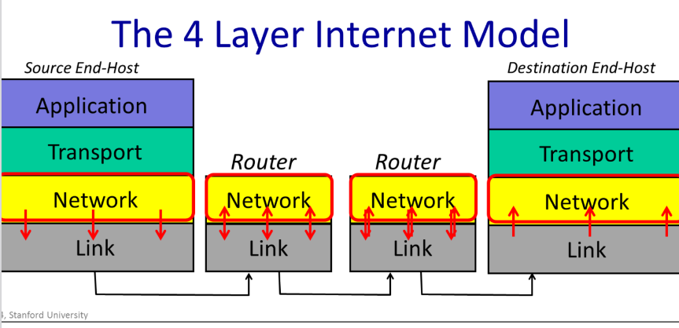

- The Internet is made up of end-hosts, links and routers.
- Data is delivered hop-by-hop over each link in turn.
- Data is delivered in packets.
- A packet consists of the data we want to be delivered, along with a header that tells the network where the packet is to be delivered, where it came from and so on.

## Link Layer
deliver data over a single link between an end-host and router, or between routers.

The Link Layer’s job is to carry the data over one link at a time.
- Ethernet and
- WiFi

## Network Layer

The network layer’s job is to deliver packets end-to-end across the Internet from the source to the destination.

A `packet` is an important basic building block in networks.

- data: a self-contained collection of data
- header: a header that describes what the data is, where it is going and where it came from.

### Network Layer Process

- deliever datagram end-to-end, Best-effort delivery-no guarantees.
- must use the Internet Protocol (IP)

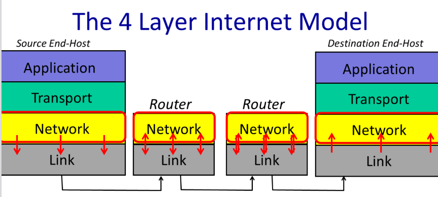

- The Network hands the `datagram` to the Link Layer below , telling it to send the datagram over the first link.
- the Link Layer says: “if you give me a datagram to send, I will transmit it over one link for you”
- The Link Layer of the router
  - accepts the `datagram` from the link, and hands it up to the Network Layer in the router.
  - The Network Layer on the router examines the destination address of the datagram, and is responsible for routing the datagram one hop at a time towards its eventual destination
  - It does this by sending to the Link Layer again, to carry it over the next link.
  - And so on until it reaches the Network Layer at the destination.

### Internet Protocol (IP)

The Internet Protocol (IP) is a protocol that is used to route packets from one network to another.

- IP makes a best-effort attempt to deliver our packets to the other end. But it makes no promises.
- IP packets can get lost, can be delivered out of order, and can be corrupted.There are no guarantees


## Transport Layer

- gurantees correct in-order delivery of data end-to-end.
- control congestion

### Transmission Control Protocol (TCP)

For now, the main thing to remember is that TCP provides a service to an application guaranteeing correct in-order delivery of data,running on top of the Network Layer service, which provides an unreliable datagram delivery service.

### User Datagram Protocol (UDP)

UDP just bundles up application data and hands it to the Network Layer for delivery to the other end. UDP offers no delivery guarantees.

## Application Layer

bi-directional reliable byte stream between two applications, using application-specific protocols.(e.g. http, bit-torrent)


## Summary
## IP is the "thin waist"


### The 7 lyaers of the OSI model

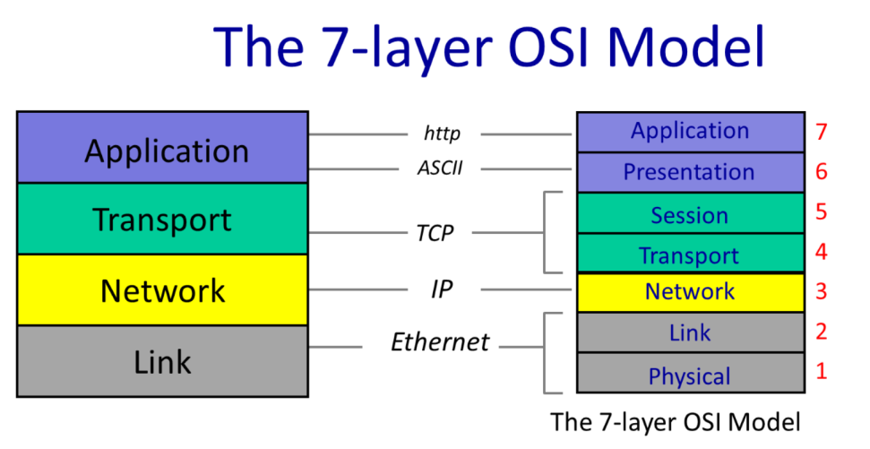

- When the transport layer has data to send, it hands a Transport Segment to the Network layer below. to drop transport segment into IP datagram
- The network layer puts the transport segement inside a new IP datagram. IP datagrams consist of a header and some data. IP’s job is to deliver the datagram to the other end.
- But first, the IP datagram has to make it over the first link to the first router， to put IP datagram inside Link frame， such as an Ethernet packet and ships it off to the first router.

# 1.3 Network Layer & IP


## The IP service model
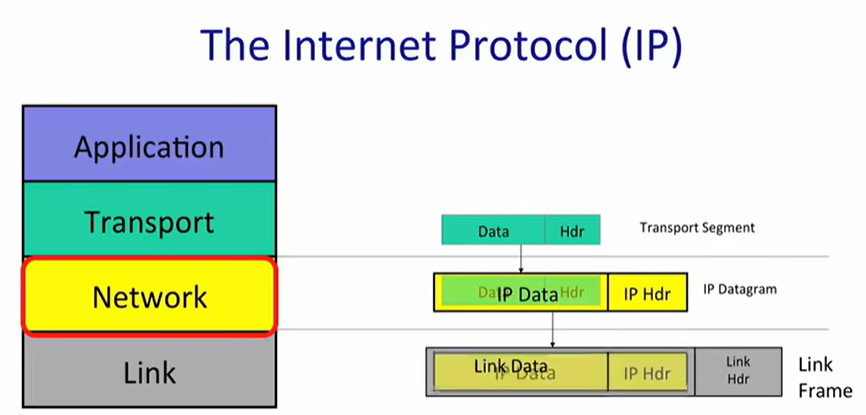

### Properties

1. **IP is a datagram service**
   The datagram is a packet that is routed individually through the network based on the information in its header. In other words, the datagram is self-contained.
   - Individually routed packets
   - hop-by-hop routing

2. **Unreliable**: Packets might be dropped

3. **Best effort**: iut only if nessesary
4. **IP is a connectionless service**
   No per-flow state
   Packets might be mis-sequenced


### Why the IP Service is So Simple?

The IP service model was designed with simplicity as a core principle for several interconnected reasons:

1. Network Simplicity and Cost Efficiency
- **Keep network infrastructure "dumb" and minimal** - This approach enables faster development, streamlined operations, and lower maintenance costs
- **Hardware optimization** - Simple network components can be implemented using dedicated hardware for high-speed operation
- **Reliability through simplicity** - Fewer complex components in distributed routers lead to more reliable and affordable systems that require less frequent upgrades

2. End-to-End Principle Implementation
- **Feature placement at endpoints** - The design philosophy emphasizes implementing intelligence at source and destination computers rather than in the network itself
- **Application-specific optimization** - Features like reliable communication and congestion control are handled by end hosts, allowing for correct implementation tailored to specific applications
- **Evolution flexibility** - Software-based implementations on end computers are easier to update and improve compared to network-hardcoded features
- **Radical departure from traditional models** - This contrasts with telephone systems that relied on simple endpoints and complex network switches

3. Flexibility for Diverse Application Needs
- **Application-controlled reliability** - Different applications can implement their own reliability mechanisms based on specific requirements
- **Real-time application support** - Services like video chat benefit from this approach since retransmitted packets might arrive too late to be useful
- **Custom service selection** - Applications can choose whether they need reliable or unreliable transmission based on their operational needs

4. Universal Link Layer Compatibility
- **Minimal assumptions about underlying technology** - IP works with both wired and wireless connections without requiring specific link-layer capabilities
- **Network agnostic design** - The protocol makes few demands on the link layer regarding retransmission or congestion control
- **Interconnection focus** - Designed specifically to interconnect existing diverse networks, reflecting its origin as the "Internet" (inter-networking)

This simple design philosophy has enabled IP to become the robust foundation for the modern internet while maintaining compatibility across diverse networking technologies and application requirements.

### The IP service Features 

1. Loop Prevention with **TTL Field**(Time To Live)
- Purpose: Prevents packets from looping infinitely in the network
- Mechanism: Uses a Time To Live (TTL) field in the datagram header that starts at a value like 128 and then is decremented by every router it passes through. If it reaches zero, IP concludes that it must be stuck in a loop and the router drops the datagram

- Operation: Each router decrements the TTL by 1; if it reaches zero, the packet is dropped as it's considered stuck in a loop
- Design philosophy: Simple mechanism that limits damage from looping packets without preventing loops entirely


2. IP will fragment packets if they are too long.

- Purpose: Handles packets that exceed link-specific size limitations
- Problem addressed: Different network links have varying maximum packet sizes (e.g., Ethernet: 1500 bytes)
- Solution: Routers can fragment oversized datagrams into smaller ones with appropriate header fields
- Reassembly: Destination hosts receive information needed to properly reassemble the original data


3. IP uses a header **checksum** to reduce chances of delivering a datagram to the wrong destination.
- Purpose: Reduces chances of delivering datagrams to incorrect destinations due to header corruption
- Implementation: Includes a checksum field calculated over the entire header
- Security aspect: Helps prevent accidental misdelivery that could cause security problems


4. Allow for new IP versions 
- IPv4: Current dominant version using 32-bit addresses (~90% of end hosts)
- IPv6: Transition version using 128-bit addresses to address IPv4 address exhaustion
- Flexibility: Supports gradual migration between versions as the Internet evolves


5. Extensible Header Options
- Capability: Allows new fields to be added to the datagram header beyond the standard format
- Advantages: Enables new features that weren't included in the original specification
- Disadvantages: May add processing overhead to routers, potentially conflicting with the goal of simplicity
- Usage: Very few options are commonly used or processed by routers in practice

## IPv4-Datagram

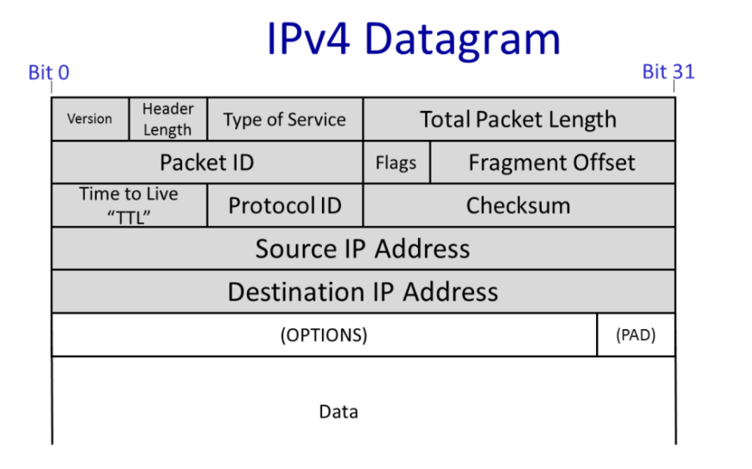

Here's a summary of the IPv4 header fields and their purposes:

**Essential Fields (the "big three"):**
1. **Destination IP Address** - Where the packet is going
2. **Source IP Address** - Where the packet came from
3. **Protocol ID** - What's inside the data field (e.g., "6" = TCP segment);  
   Essentially, it allows the destination end host to demultiplex arriving packets, sending them to the correct code to process the packet.
  Ex: If the Protocol ID has the value “6” then it tells us the data contains a TCP Segment, and so we can safely pass the datagram to the TCP code and it will be able to parse the segment correctly.
  **The Internet Assigned Numbers Authority (IANA)** defines over 140 different values of Protocol ID, representing different transport protocols.


**Version and Size Fields:**
1. **Version** - Identifies IP version (IPv4 or IPv6)
2. **Total Packet Length** - Up to 64k Bytes (header + data)
3. **Header Length** - Size of the header (varies due to optional fields)

**Reliability and Control Fields:**
7. **Time to Live (TTL)** - Decremented by each router; packet dropped when it reaches zero, preventing infinite loops
8. **Checksum** - Validates header integrity to avoid misdelivery due to corruption

**Fragmentation Fields:**
9. **Packet ID, Flags, and Fragment Offset** - Allow routers to break packets into smaller pieces when needed for links with smaller maximum sizes

**Quality of Service:**
10. **Type of Service** - Hints to routers about packet importance/priority

The key takeaway: IP is deliberately simple. It provides best-effort delivery with minimal guarantees—just basic addressing, demultiplexing, and some mechanisms to prevent disasters like infinite loops.


- The Type of Service field
  gives a hint to routers about how important this packet is.

- The Checksum field
  is calculated over the whole header so just in case the header is corrupted, we are not likely to deliver a packet to the wrong desination by mistake.

# 1.4 Life of a Packet


## TCP Byte Stream

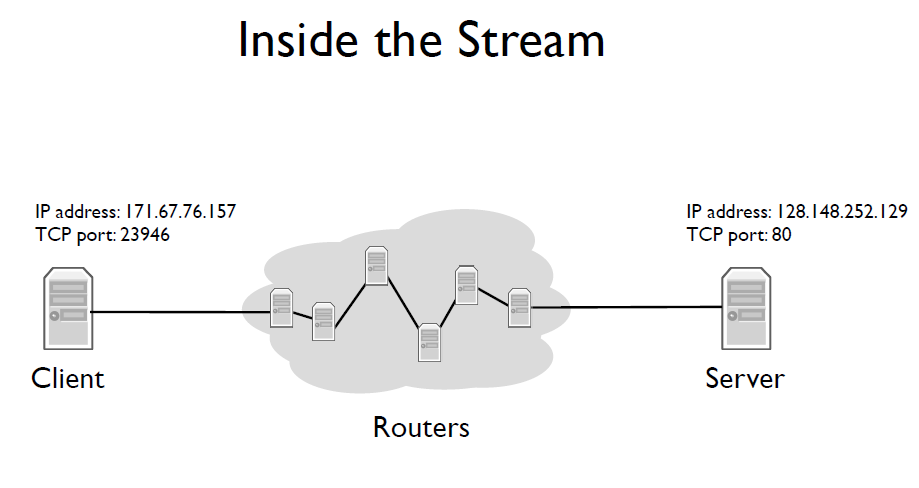

**Two-Level Addressing:**
To deliver data to applications (not just computers), two addresses are needed:
1. **Internet Protocol(IP) Address** - Network layer uses this to deliver packets to the destination computer
2. **TCP Port** - Transport layer uses this to deliver data to the correct application on that computer

Example: Web servers typically run on **TCP port 80**, 
So when we open a connection to a web server, we send IP packets to the computer running the web server whose destination address is that computer’s IP address. Those IP packets have TCP segments whose destination port is 80.
so connections to web servers use the server's IP address plus destination port 80.

**TCP Connection Establishment - Three-Way Handshake:**
1. **SYN** - Client sends a "synchronize" message to the server
2. **SYN-ACK** - when the server responds with a “synchronize” message that also acknowledges the clients “synchronize”, or a “synchronize and acknowledge message”
3. **ACK** - Client acknowledges the server's synchronize

This three-message exchange opens a connection between client and server.

**Packet Routing:**
- Clients and servers aren't directly connected; packets travel through intermediate routers
- Each link between routers is called a **hop**
- Routers forward packets along their links, deciding which link to use for each arriving packet
- Routers can also deliver packets to their own software (e.g., when you log into the router itself)

**Key Insight:** The network layer (IP) delivers to computers, while the transport layer (TCP) delivers to applications within those computers.


### Inside each hop in router

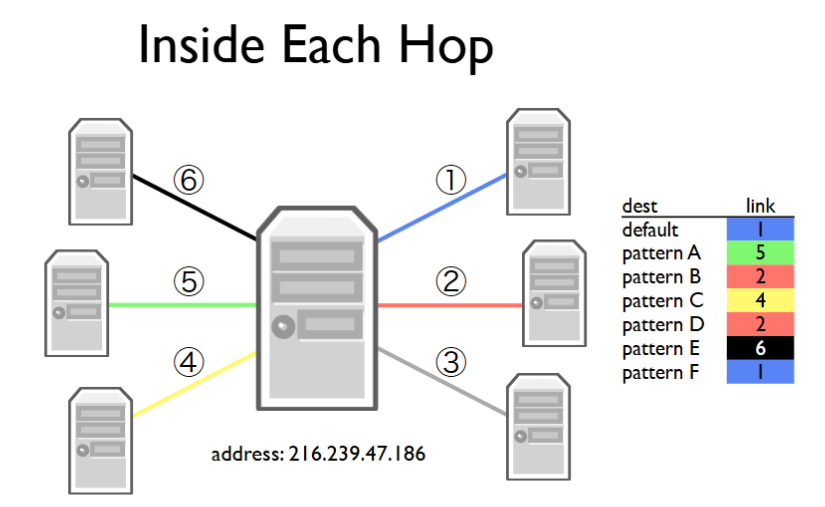

How does a router make this decision?

- Forwarding table:

A forwarding table consists of a set of IP address patterns and the link to send across for each pattern

When a packet arrives, the router checks which forwarding table entry’s pattern best matches the packet. It forwards the packet along that entry’s link.

Generally, “best” means the most specific match. I’ll describe how this matching works in more detail in the video on longest prefix match.


## Under the Hood

1. Request web page from `www.cs.brown.edu`
- method1: checke IP address with F12
- method2: use `nslookup`
```bash
$ nslookup www.cs.brown.edu
服务器:  UnKnown
Address:  192.168.2.1

非权威应答:
DNS request timed out.
    timeout was 2 seconds.
名称:    www.cs.brown.edu
Address:  128.148.32.12
```
2. Use wireshark to see TCP byte stream establishment and data exchange
3. Use traceroute to see route packets take through Internet

### wireshark

[网络顶级掠食者 Wireshark 抓包从入门到实战](https://www.bilibili.com/video/BV12X6gYUEqA/?spm_id_from=333.337.search-card.all.click&vd_source=b3d4057adb36b9b243dc8d7a6fc41295)

[www.wireshark.org](https://www.wireshark.org/download.html)

1. Request web page from www.cs.brown.edu

2. Open wireshark
   1. 选择 网卡
   2. filter:
      tcp.port == 80 && ip.addr == 128.148.32.12

      tcp.port == 7897 && ip.addr == 128.148.32.12

3. open browser and request `www.cs.brown.edu` or `curl www.cs.brown.edu `

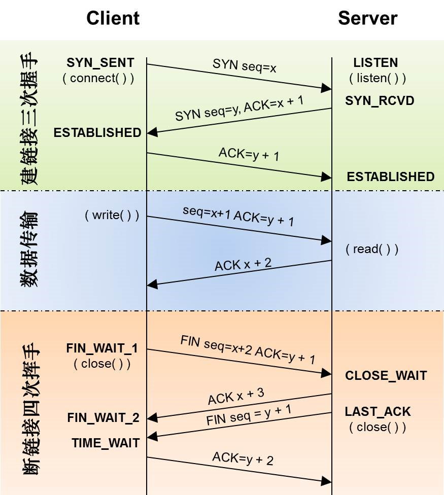
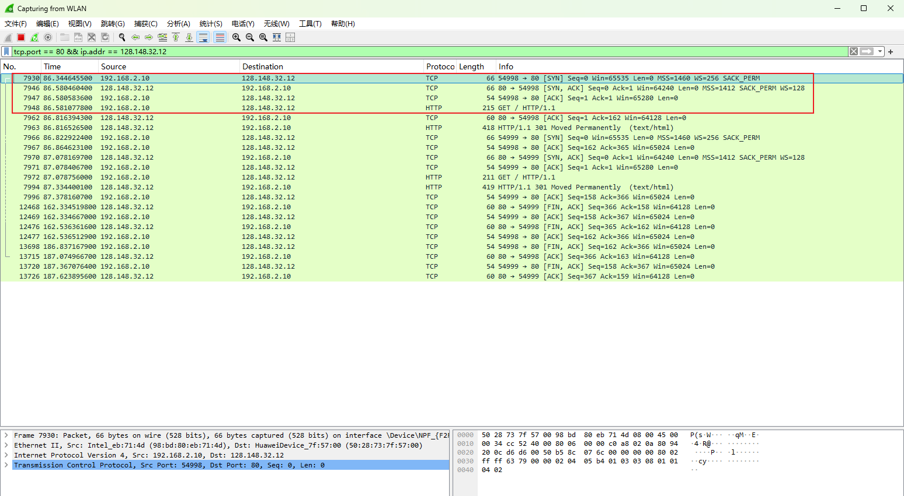

[ssl-handshakes](https://www.ruanyifeng.com/blog/2014/09/illustration-ssl.html)

### traceroute

```bash
sudo apt install inetutils-traceroute
traceroute --version

# nslookup stands for "Name Server Lookup". It's a network administration command-line tool used to query the Domain Name System (DNS) to obtain domain name or IP address mapping information.
nslookup www.cs.brown.edu
# ;; Got recursion not available from 10.255.255.254
# Server:         10.255.255.254
# Address:        10.255.255.254#53

# Non-authoritative answer:
# Name:   www.cs.brown.edu
# Address: 128.148.32.12


traceroute www.cs.brown.edu
# traceroute www.csail.mit.edu

# traceroute to www.cs.brown.edu (128.148.32.12), 64 hops max
#   1   172.23.160.1  0.202ms  0.101ms  0.124ms
#   2   192.168.1.1  0.549ms  0.420ms  0.399ms
#   3   183.158.115.65  4.255ms  3.648ms  3.704ms
#   4   60.163.248.201  3.569ms  60.163.248.199  3.179ms  115.220.248.50  3.127ms
#   5   60.163.248.172  3.531ms  3.385ms  3.414ms
#   6   115.233.20.37  3.752ms  3.716ms  3.597ms
#   7   202.97.33.241  11.560ms  11.368ms  12.276ms
#   8   202.97.24.222  6.610ms  6.558ms  6.501ms
#   9   202.97.39.53  13.724ms  13.678ms  13.496ms
#  10   202.97.99.154  155.042ms  154.282ms  154.885ms
#  11   *


curl http://nginx.org/
3.125.197.172:80

```


# 1.5 Principle: Packet Switching
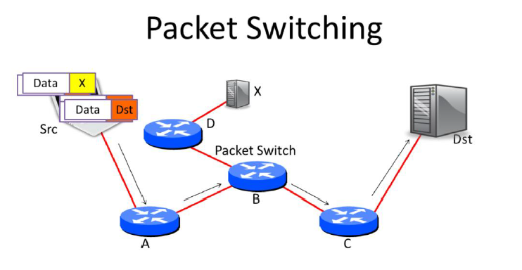

## What is a Packet?  
A self-contained unit of data that carries information necessary for it to reach its destination.
- Data - the actual information being sent
- Header - contains the destination address (like an envelope in the postal system)

The packet contains enough information for the network to independently deliver it to its destination.

## What is Packet Switching?
Packet switching is the idea that we break our data up into discrete, self-contained chunks of data. Each chunk, called a packet, carries sufficient information that a network can deliver the packet to its destination.

- Key principle: 
Independently for each arriving packet, pick its outgoing link. If the link is free, send it. Else hold the packet for later.

Each packet is routed separately and independently - there's no dedicated circuit. Consecutive packets can even take different paths through the network.

## How Does Packet Switching Work?


**Two main approaches:**

**a) Source Routing (Self-Routing):**
- The packet contains an explicit route specifying each switch along the way (e.g., "A → B → C → destination")
- Each switch reads the next hop from the packet and forwards accordingly
- Generally disabled in the Internet due to security concerns

**b) Hop-by-Hop Forwarding (most common today):**
- Each switch maintains a **forwarding table** mapping destination addresses to next hops
- Packet only needs to carry the **destination address**
- Each switch looks up the destination in its local table and forwards to the appropriate next hop
- The packet travels hop-by-hop until it reaches its destination

**Network components:**
- **End-hosts** (source and destination)
- **Links** (connections between switches)
- **Packet switches** (routers, gateways, Ethernet switches) - forward packets based on destination address in the header


## Two Properties of Packet Switching:

**1. Simple packet forwarding: Stateless, Simple Switching:**
- Each switch makes **individual, local decisions** for each packet independently
- The switch **doesn't need to keep extra state** about previous packets or track whether packets belong to the same flow/connection
- The switch doesn't need to know what the packets are for (Skype call, web request, firmware update, etc.) - **it just forwards packets**
- This greatly **simplifies the switch** design

### No per-flow state required

Flow: A collection of datagrams belonging to the same end-to-end communication, e.g. a TCP connection.


**2. Efficient Link Sharing:**
- A switch can **efficiently share a link between many parties** without dedicating capacity
- **Dynamic allocation** - whoever needs bandwidth can use it when available

**Example:** Home WiFi router with two people:
- Person 1 reading a page (idle) → Person 2 can download at **full link speed**
- Person 1 starts loading a new page → Link is **shared between both**
- Download completes → Person 1 gets **full link speed** again

The link capacity automatically adjusts based on demand, with no pre-allocation or reservation needed. This is much more efficient than dedicating fixed portions of the link to each user.


# 1.6 Principle: Layering

Reasons for layering
1. Modularity
2. Well defined service
3. Reuse
4. Separation of concerns
5. Continuous improvement
6. Peer-to-peer communications

# 1.7 Principle: Encapsulation
which is the process of placing a packet processed at one layer inside the data of the packet below.
This helps a clear separation of concerns between how data is processed at each layer in the hierarchy.
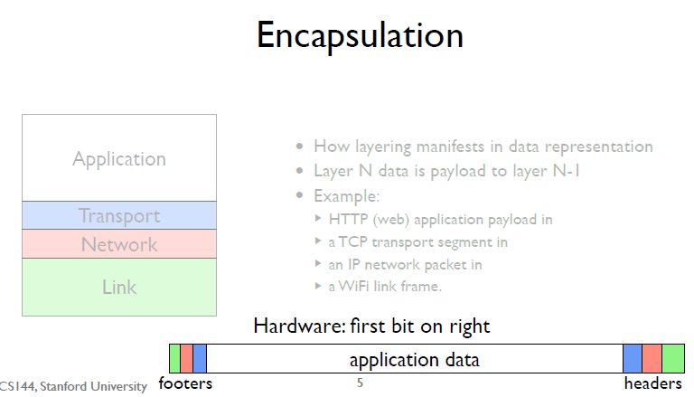

## Encapsulation Flexibility
- Encapsulation allows you to layer recursively

## Example: Virtual Private Network (VPN):
- HTTP (web) application payload in
- a TCP transport segment in
- an IP network packet in
- a secured TLS(Transport layer Security) presentation message in
- a TCP transport segment in
- an IP network packet in
- an Ethernet link frame.


Great example. You’re already thinking at the right abstraction level — encapsulation as recursion. Let’s make it precise and mechanical.

---

### What a VPN Actually Does

A **Virtual Private Network (VPN)** creates a **secure tunnel** between your device and a trusted gateway (e.g., your company network).

Instead of sending your IP packets directly to their destination, your machine:

> Encrypts them
> Wraps them
> Sends them to the VPN gateway
> The gateway unwraps and forwards them

So the VPN is basically:

> A secure transport pipe that carries *entire IP packets* inside it.

---
### Mental Model (Important)

Think of VPN like this:

> You put a sealed envelope (inner IP packet)
> Inside a locked safe (TLS session)
> Ship it to your office
> Office unlocks safe and delivers envelope internally

Recursive layering.

---

### Architectural View
VPN gateway acts as:

| Role          | Function                  |
| ------------- | ------------------------- |
| TLS server    | Terminates encryption     |
| Authenticator | Validates users           |
| Router        | Forwards inner IP packets |
| Firewall      | Enforces access policies  |

Destination server acts as:
| Role                 | Function           |
| -------------------- | ------------------ |
| Normal host          | Serves application |
| No Internet exposure | Private only       |
| No VPN awareness     | Just standard IP   |

#### Clean Layer Visualization
```
Client
  ↓
Encrypted Tunnel
  ↓
VPN Gateway
  ↓
Internal Routing
  ↓
Destination Server
```

#### Why This Is Architecturally Clean

Phil’s key insight:

The 4-layer model isn’t rigid.

You can:

* Run IP inside IP
* Run IP inside TLS
* Run Ethernet over IP
* Run MPLS over Ethernet

Protocols don’t care — as long as the outer layer can carry bytes.

Encapsulation enables composability.

#### Why This Is Powerful

Because:

* Your home network doesn’t need to understand company routing
* Your ISP can’t read your traffic
* The public Internet only sees encrypted TLS
* Internal resources remain private

All access control is centralized at the VPN gateway.

This is operationally elegant.

---


### Normal Internet Access (No VPN)

If you access an internal server `10.0.0.25` directly (impossible from home):

```
HTTP
  ↓
TCP
  ↓
IP (dst = 10.0.0.25)
  ↓
Ethernet
```

This fails because your home router cannot route to private IP space `10.0.0.0/8`.

---

### 🔐 With VPN

Now you first establish a secure connection to the company VPN gateway.

Let’s say:

* Your local IP: `192.168.2.10`
* VPN gateway public IP: `203.0.113.5`
* Internal server: `10.0.0.25`

VPN Gateway (Edge / Entry Point)
This is:
- The public-facing machine
- The device that terminates the encrypted tunnel
- The enforcement point for authentication & access control
- The router into the private network

Think of it as: A secure border checkpoint + router.

It has:
- A public IP (reachable from Internet)
- A private IP (inside company LAN)

---

#### Phase 1 — Establish Secure Tunnel

You create a TLS connection to the VPN gateway:

```
TCP handshake to 203.0.113.5
TLS handshake
Keys exchanged
Encrypted tunnel established
```
Now you have a secure pipe.
---

#### Phase 2 — Send Internal Traffic Through Tunnel

- Step 1 — Client Creates Inner Packet
Your browser generates:
```
HTTP GET /internal
```

That becomes:
```
HTTP
↓
TCP
↓
IP (dst = 10.0.0.25)
```
That packet cannot be sent directly.

- Step 2 — OS Encapsulates It
But instead of sending this IP packet normally, your OS does something clever:
It treats that entire IP packet as **data**.
Now encapsulation becomes:

```
[Inner]
HTTP
  ↓
TCP
  ↓
Inner IP (dst = 10.0.0.25)

[Outer]
TLS (encrypted)
  ↓
TCP (dst = 203.0.113.5)
  ↓
Outer IP (dst = 203.0.113.5)
  ↓
Ethernet
```
This is what travels across Internet.

Exactly like your example:
> HTTP inside TCP inside IP inside TLS inside TCP inside IP inside Ethernet

---

#### Phase 3: Gateway Routes Internally

What Happens at the VPN Gateway

At the gateway:

1. Outer IP received
2. Outer TCP processed
3. TLS decrypted
4. Inner IP packet extracted
5. Gateway routes that inner IP packet normally

So the gateway now sees:
```
IP (dst = 10.0.0.25)
```
And forwards it inside the company LAN.

---
#### Phase 4: Internal Server Receives
Now the internal server receives a completely normal packet.


---

### Key Concept: Tunneling

VPN = **IP tunneling**

You are transporting Layer 3 packets inside another Layer 4 session.

This is recursive layering.

The OS creates a **virtual network interface** (TUN device).

Your routing table changes:

Instead of:

```
10.0.0.0/8 → default gateway
```

It becomes:

```
10.0.0.0/8 → VPN tunnel interface
```

So traffic automatically flows into the tunnel.

---

### Types of VPN (Important Distinction)

Not all VPNs use TLS exactly like this.

#### 1️⃣ SSL VPN (OpenVPN, TLS-based)

Exactly like your example.

#### 2️⃣ IPsec VPN

Encapsulates IP inside ESP packets at Layer 3.

#### 3️⃣ WireGuard

Minimal UDP-based encrypted tunnel.

WireGuard stack looks like:

```
Inner IP
↓
UDP
↓
IP
↓
Ethernet
```

No TLS, simpler crypto model.

---

#### What Wireshark Sees

If you capture traffic while VPN is active, you will NOT see:

```
IP → 10.0.0.25
```

You will see:

```
IP → 203.0.113.5
TCP 443 (TLS)
Encrypted Application Data
```

Because the internal IP packet is inside encrypted payload.

This is the same reason you couldn’t see remote handshake with proxy earlier.

Encapsulation hides the inner layers.

---


# 1.8 Memory, Byte Order, and Packet Formats

## Endianness

How you lay out a multibyte value in memory is called endianness

- **Little endian**:
  the least significant byte is at the lowest address.
  So the least significant byte comes first in memory. It turns out that from a computational and architectural standpoint, this can make the most sense.
- **Big endian**:
  where the most significant byte is the lowest address. Big endian makes more sense to a human reader, because it’s how we write numbers, with the most significant digits first.

| Width | Decimal    | Binary     | Hexadecimal | Little Endian       | Big Endian          |
| ----- | ---------- | ---------- | ----------- | ------------------- | ------------------- |
| 16    | 1024       | 2^10       | 0x0400      | 0x00 0x04           | 0x04 0x00           |
| 16    | 53         |            | 0x0035      | 0x35 0x00           | 0x00 0x35           |
| 16    | 4116       |4096=2^12+20| 0x1014      | 0x14 0x10           | 0x10 0x14           |
| 32    | 5          |            | 0x00000005  | 0x05 0x00 0x00 0x00 | 0x00 0x00 0x00 0x05 |
| 32    | 83,886,080 |            | 0x05000000  |                     |                     |
| 32    | 305,414,945|            | 0x21433412  |                     |                     |     


## Network Byte Order

- Different processors have different endianness
  - Little endian: x86,
  - big endian: ARM
- To interoperate, they need to agree how to represent multi-byte fields
- Network byte order is big endian

```C
uint16_t val = 0x400;
uint8_t* ptr = (uint8_t*)&val;
if (ptr[0] == 0x40) {
   printf(“big endian\n”)
}
else if (ptr[1] == 0x40) {
   printf(“little endian\n”);
}
else {
   printf(“unknown endianness!\n”);
}
```

### Portable Code

You have to convert network byte order values to your host order

```C
uint16_t http_port = 80; // host byte order : 80=0x0050 = 0x50 0x00 (Little Endian)
if(packet->port== http_port){
  // network byte order(0x00 0x50) vs host byte order (0x50 0x00)         
  // Wrong
  ...
}


// Using helper functions: ntohs, htons, ntohl, htonl
// ntohs: network to host short
// htons: host to network short
#include <arpa/inet.h>
uint16_t http_port = 80; 
uint16_t packet_port = ntohs(packet->port);
if(packet_port== http_port){
  // OK
  ...
}
```

### Packet Formats

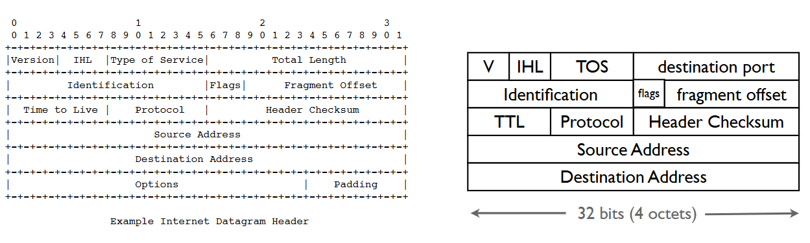

# 1.9 Names and Addresses: IPv4

## Goal of Internet Protocol Addresses
- Stitch many different networks together
- Need network-independent, unique address


## Internet Protocol, Version 4
- An IPv4 address identifies a device on the Internet
  - Layer 3 (network) address
  
- 32 bits long (4 octets): a.b.c.d
  - Example: 171.64.64.64
  - Example: 128.30.76.82
  - Example: 12.22.58.30

- Netmask: apply this mask, if it matches, in the same network
  - Netmask of 255.255.255.0 means if the first 24 bits match
  - Netmask of 255.255.252.0 means if the first 22 bits match
  - Netmask of 255.128.0.0 means if the first 9 bits match
  - Smaller netmask (fewer 1s) means larger network

```bash
无线局域网适配器 WLAN:

   连接特定的 DNS 后缀 . . . . . . . : ctc
   本地链接 IPv6 地址. . . . . . . . : fe80::748b:765f:409d:3fb3%21
   IPv4 地址 . . . . . . . . . . . . : 192.168.2.10
   子网掩码  . . . . . . . . . . . . : 255.255.255.0
   默认网关. . . . . . . . . . . . . : 192.168.2.1

```
## Address Structure

- Originally hierarchical: network + host
  - Network to get to correct network (administrative domain)
  - Host to get to correct device in network (within administrative domain)
- Originally 3 classes of addresses: class A, class B, class C

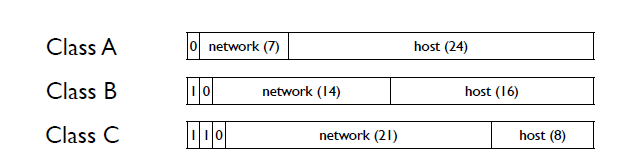

### Address Structure Today
- Still assign contiguous ranges of addresses to nearby networks
  Class A, B, C is too coarse grained [e.g., MIT dorms!](http://news.stanford.edu/news/1999/january27/itss127.html)

#### Classless Inter-Domain Routing (CIDR)
- What is CIDR?
CIDR (Classless Inter-Domain Routing) is a flexible system for structuring and allocating IPv4 addresses that replaced the older class-based system (Class A, B, C).

- Key principle: 
  All CIDR blocks define address blocks that are powers of 2 in size.

- How CIDR Works:
Flexible prefix lengths: Instead of only 8, 16, or 24-bit prefixes, CIDR allows any number of bits as the network prefix, This is called the netmask length or "slash notation"

  - Address block is a pair: address,count
  - Counts are powers of 2, specify netmask length
  - 171.64.0.0/16 means any address in the range 171.64.0.0 to 171.64.255.255
  - A /24 describes 256 addresses, a /20 describes 4,096 addresses

- Stanford today has 5 /16 blocks -- 325,000 addresses

 
### IPv4 Address Assignment
- IANA: Internet Assigned Numbers Authority
  - Internet Corporation for Assignment of Names and Numbers (ICANN)’s job
- IANA gives out /8s to Regional Internet Registries (RIRs)
  - Ran out in February 2011, in special end case of giving 1 to each RIR
- RIRs responsible for geographic regions, each has own policy
  - AfriNIC: Africa
  - ARIN: U.S.A., Canada, Carribean, Antarctica
  - APNIC: Asia, Australia, New Zealand
  - LACNIC: Latin America, Carribean
  - RIPE NCC: Europe, Russia, Middle East, Central Asia

# 1.10 Longest Prefix Match

Internet routers can have many links. They have many options for which direction to forward a received packet. To select which link to forward a packet over, routers today typically use an algorithm called Longest Prefix Match.

## How Longest Prefix Match Works:

When a router receives a packet, it looks at the **destination IP address** and compares it against multiple entries in its **forwarding table**. 
- Forwarding table is a set of CIDR entries, Each entry has:
- A network prefix (in CIDR notation, like /16, /20, /24)
- A next hop (which link to forward to)

|    dest       | link |
|---------------|------|
| 0.0.0.0/0     |  1   |
| 171.33.0.0/16 |  5   |

The router selects the forwarding entry that has the **longest matching prefix** with the destination address.

- An address might match multiple entries
  E.g., 171.33.0.1 matches both entries on right

- Algorithm: use forwarding entry with the longest matching prefix
  Longest prefix match will chose link 5 for 171.33.0.1


## Why "Longest"?

Since CIDR allows flexible prefix lengths, a destination address might match multiple entries in the forwarding table. For example:
- A destination might match both a /16 prefix (more general) and a /24 prefix (more specific)
- The router chooses the **/24** because it's the **longest (most specific) match**

## The Principle:

**More specific routes take precedence over more general routes.**

This allows the Internet to have:
- **General/default routes** for broad address blocks
- **Specific routes** for particular subnets that need special handling

The longest prefix match ensures packets are routed as specifically as possible, giving network operators fine-grained control over how traffic flows through their networks.


## Example
A client wants to open a TCP connection to a web server on port 80. Packets travel through multiple routers, and each router must decide which link to forward packets on.


### The Forwarding Table:
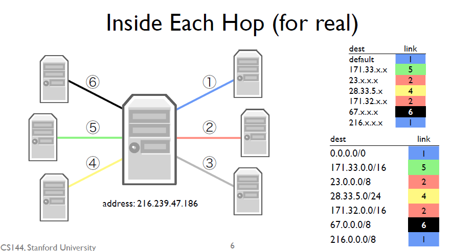
Here's an explanation of how Longest Prefix Match works using your example:

The router has a forwarding table with entries like:
- **Default route** (0.0.0.0/0 or all wildcards) → Link 1
- **171.33.0.0/16** (171.33.x.x) → Link 5
- Other specific entries with varying prefix lengths

Each entry has:
1. **CIDR prefix** - describes a block of addresses
2. **Next hop/link** - where to forward matching packets

### How LPM Works - Step by Step:

**1. Packet arrives** with a destination IP address

**2. Router checks all matching entries:**
- An address can match **multiple** entries in the table
- Example: Address **171.33.5.245** matches:
  - Default route (0.0.0.0/0) - 0 bits match
  - 171.33.0.0/16 - first 16 bits match

**3. Router selects the LONGEST (most specific) match:**
- Default route has prefix length **/0** (0 bits)
- 171.33.0.0 has prefix length **/16** (16 bits)
- **16 > 0**, so the router chooses the /16 entry
- Packet is forwarded on **Link 5**

### Key Principle:

**"Most specific route wins"** - The entry with the longest matching prefix (most bits in common with the destination) is chosen, even if multiple entries match.

### Why This Matters:

- **Default route** catches everything that doesn't have a more specific match
- **Specific routes** allow fine-grained control for particular subnets
- The Internet can have general routes with specific exceptions


# 1.11 Address Resolution Protocol(ARP)

## What is ARP?

**ARP (Address Resolution Protocol)** is the mechanism by which the network layer discovers the **link address** (like an Ethernet address) associated with a **network address** (IP address) for devices it's directly connected to.

In other words, ARP answers the question: **"I have an IP packet whose next hop is this IP address -- what link address should I send it to?"**

## ARP Properties

- Generates mappings between layer 2 and layer 3 addresses

  - Nodes cache mappings, cache entries expire
    Every node keeps a cache of mappings from IP addresses on its network to link layer addresses.

- Simple request-reply protocol
  - “Who has network address X?”
  - “I have network address X.”
- The response includes the link layer address.
  Request sent to link layer broadcast address

- Reply sent to requesting address (not broadcast)
- Packet format includes redundant data
  - Request has sufficient information to generate a mapping
  - Makes debugging much simpler
- No “sharing” of state: bad state will die eventually
  
## Why is ARP Needed?

Each protocol layer has its own names and addresses:

**Network Layer (IP):**
- Uses **IP addresses** (32-bit for IPv4)
- Describes a **host** - a unique destination at the network layer
- Example: 192.168.0.5

**Link Layer (Ethernet):**
- Uses **link addresses** (48-bit for Ethernet, also called MAC addresses)
- Describes a particular **network card** - a unique device that sends/receives frames
- Preconfigured on each Ethernet card at manufacture
- Written as colon-delimited hexadecimal octets: **0:13:72:4c:d9:6a**

**The Problem:** When you want to send an IP packet to a device on your local network, you know its IP address, but you need its link layer address to actually transmit the frame.

## How the Two Addresses Relate:

**Logically decoupled but practically coupled:**

- The protocols themselves are independent - IP doesn't care about Ethernet addresses
- But in practice, they're managed together

**Example scenario:**
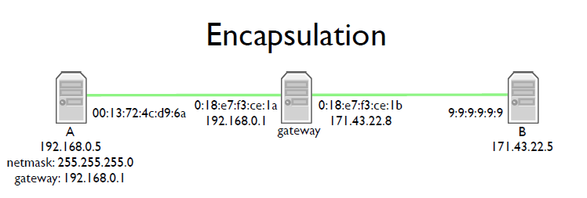

- A gateway/router often has **multiple network interfaces**
- Each interface has:
  - Its own **link layer address** (identifies the specific network card)
  - Its own **IP address** (identifies the host within that network segment)

**Gateway example:**
- **Left interface**: Link address A, IP 192.168.0.1 (in the 192.168.0.0/24 network)
- **Right interface**: Link address B, IP 171.43.22.8 (in the 171.43.22.0/24 network)

This is necessary because of netmasks - a single IP address can only belong to one network prefix.

## Why Separate Addresses?

**Historical reasons:**
- Internet needed to run on many different link layer technologies
- Existing link layers weren't going to abandon their addressing schemes for IP
- Separate link layer addresses provide useful functionality (e.g., network registration using MAC addresses)

**Practical benefit:** Link layer addresses can be used for device identification and network management independent of IP configuration.


the mechanism by which the network layer can discover the link address associated with a network address it’s directly connected to.
Put another way, it’s how a device gets an answer to the question:
“I have an IP packet whose next hop is this address -- what link address should I send it to?”


## ARP Packet Format (RFC826)

The Address Resolution Protocol, or ARP, is the mechanism by
which the network layer can discover the link address associated
with a network address it’s directly connected to. Put another way,
it’s how a device gets an answer to the question: “I have an IP
packet whose next hop is this address -- what link address should
I send it to?”

ARP is needed because each protocol layer has its
own names and addresses. An IP address is a
network-level address. It describes a host, a unique
destination at the network layer. A link address, in
contrast, describes a particular network card, a
unique device that sends and receives link layer
frames. Ethernet, for example, has 48 bit addresses.
Whenever you buy an Ethernet card, it’s been
preconfigured with a unique Ethernet address. So an
IP address says “this host”, while an Ethernet
address says “this Ethernet card.”

48-bit Ethernet addresses are usually written as a colon delimited set of 6 octets written in hexidecimal, such as
0:13:72:4c:d9:6a as in the source, or 9:9:9:9:9:9 as in the destination.
One thing that can be confusing is that while these link layer and network layer addresses are completely
decoupled with respect to the protocol layers, in terms of assignment and management they might not be. For
example, it’s very common for a single host to have multiple IP addresses -- one for each of its interfaces. It
needs to because of the concept of a netmask. For example, look at this hypothetical setup. The gateway, in the
middle, has a single IP address: 192.168.0.1. It has two network cards, one connecting it to the destination
171.43.22.5, one connecting it to the source, 192.168.0.5.
The address 192.168.0.1 can really only be in one of these networks, the source network. The netmask needed
for 192.168.0.1 to be in the same network as 171.43.22.5 is 128.0.0.0, or just one bit of netmask! But it can’t be
that all IP addresses whose first bit is 1 are in the same network as 171.43.22.5 -- 192.168.0.5, for example,
needs to be reached through the gateway.

So instead we often see setups like this, where the gateway or router has multiple interfaces, each
with their own link layer address to identify the card, and also each with their own network layer
address to identify the host within the network that card is part of. For the gateway, the left
interface has IP address 192.168.0.1, while the right interface has IP address 171.43.22.8.
The fact that link layer and network layer addresses are decoupled logically but coupled in
practice is in some ways a historical artifact. When the Internet started, there were many link
layers, and it wanted to be able to run on top of all of them. These link layers weren’t going to
suddenly start using IP addresses instead of their own addressing scheme. Furthermore, there
turns out to be a bunch of situations where having a separate link layer address is very valuable.
For example, when I register a computer with Stanford’s network, I register its link layer address
-- the address of the network card.