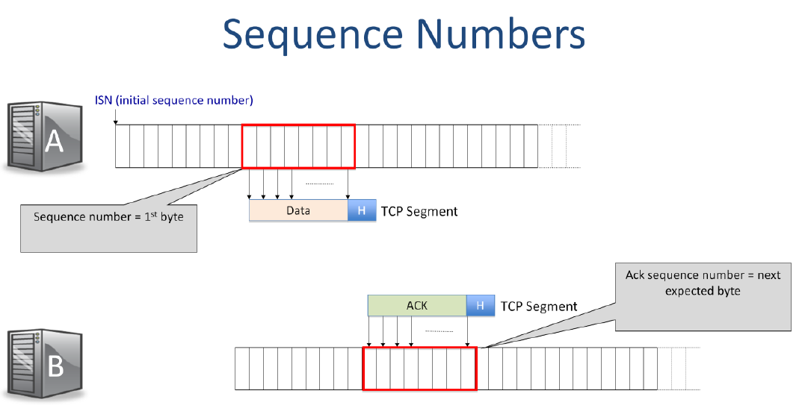

### TCP segment format

**The TCP Segment header** is much longer and more complicated than, say the IP and Ethernet headers. That is because a TCP connection is reliable – In order to make the communication reliable, the two ends of the connection need to exchange more information so they know which bytes have arrived, which are missing, and the status of the connection.
Here is a quick summary of the most important fields in the TCP header. You don’t need to remember the layout of the header, but you should learn what each field does. If you need a reference, I’d recommend Wikipedia or the Kurose and Ross textbook.

- **Destination port**
  The Destination port tells the TCP layer which application the bytes should be delivered to at the other end. When a new connection starts up, the application tells TCP which service to open a connection with.
  For example, if TCP is carrying **web data**, it uses port 80, which is the port number for TCP. You’ll learn more about port numbers later, but if you are curious, you can look up the well known port numbers at the IANA website. Search for IANA port numbers. You’ll find thousands of port numbers defined for different well known services.
  For example, when we open a connection to an **ssh server**, we use destination port 22.
  For **smtp (the simple mail transfer protocol)** we use port 23. Using a well known port number lets Host B identify the application it should establish the connection with.

- **Source port**:
  The Source port tells the TCP layer at the other end which port it should use to send data back again.
  In our example, when Host B replies to Host A, it should place Host A’s source port number in the destination port field, so that Host A’s TCP layer can deliver the data to the correct application. When a new connection starts, the initiator of the connection – in our case Host A – generates a unique source port number, so differentiate the connection from any other connections between Host A and B to the same service.

- **Sequence number**
  The Sequence number indicates the position in the byte stream of the first byte in the TCP Data field.

  A TCP sequence number is a 32-bit number that uniquely identifies the position of the first byte of data in a TCP segment within the overall data stream.

  - **The sequence number** in a segment from A to B includes the sequence number of the first byte, offset by the initial sequence number.
  - **The acknowledgment sequence number** in the segment from B back to A tells us which byte B is expecting next, offset by A’s initial sequence number.

  For example:
  if the Initial Sequence number(ISN) (chosen by the sender) is 1,000 and this is the first segment, then the Sequence number is 1,000. If the sender want to send segment is 500 bytes long, then the sequence number in the next segment will be 1,500 and so on.

  | Segement | Sequence number | Payload Size | Next Sequence number |
  | -------- | --------------- | ------------ | -------------------- |
  | 1        | 1,000           | 500          | 1,500                |
  | 2        | 1,500           | 100          | 1,600                |
  | 3        | 1,600           | 500          | 2,100                |

  Why do we need it?
    - Ordering: Helps the receiver put segments back in the correct order.
    - Reliability: Allows the receiver to detect missing segments and ask for retransmission (via ACKs).
    - Flow Control: In combination with acknowledgment numbers and window sizes, it helps manage data flow.

- **Acknowledgment sequence number**
  The Acknowledgment sequence number tells the other end which byte we are expecting next. It also says that we have successfully received every byte up until the one before this byte number.

  For example, if the Acknowledgment Sequence number is 751, it means we have received every byte up to and including byte 750. Notice that there are sequence numbers for both directions in every segment. This way, TCP piggybacks acknowledgments on the data segments traveling in the other direction.

- **checksum**
  The 16 bit checksum is calculated over the entire header and data, and helps the receiver detect corrupt data. For example, bit errors on the wire, or a faulty memory in a router. You’ll learn more about error detection and checksums in a later video.

- **Window**

The flow control window is telling the other endpoint how much received buffer space its sender has

Ex: 2000 means 

- **Header Length**
  The Header Length field tells us how long the TCP header is.

- **TCP Options fields**
  The TCP Options fields are, well, optional. They carry extra, new header fields that were thought of and added after the TCP standard was created. The Header Length field tells us how many option fields are present. Usually there are none.

- **Flags**
  Finally, there are a bunch of Flags used to signal information from one end of the connection to the other.
  - **U: URG**:
  - **P: PSH flag** tells the TCP layer at the other end to deliver the data immediately upon arrival, rather than wait for more data. This is useful for short segments carrying time critical data, such as a key stroke. We don’t want the TCP layer to wait to accumulate many keystrokes before delivering them to the application.
  - **A: ACK** flag tells us that the Acknowledgement sequence number is valid and we are acknowledging all of the data up until this point.
  - **S: SYN flag** tells us that we are signalling a synchronize, which is part of the 3way handshake to set up the connection.
  - **F: FIN flag** signals the closing of one direction of the connection.
  - **R: RST flag** resets the connection.

- **Offset**

- Urgent Pointer
- Options
- Padding

### TCP connection Unique ID

A TCP connection is uniquely identified by five pieces of information in the TCP and IP headers.

#### The Five-Tuple Identifier

A TCP connection is **uniquely identified by five pieces of information** from the TCP and IP headers:

1. **Source IP Address** - Identifies the source host
2. **Destination IP Address** - Identifies the destination host  
3. **Protocol ID** - Set to TCP (value "6")
4. **Source Port** - Identifies the application process on the source host
5. **Destination Port** - Identifies the application process on the destination host

**Together, these 5 fields uniquely identify the TCP connection Internet-wide at any instant.**

#### Ensuring Uniqueness: Source Port Selection

**Problem:** Host A must pick a unique source port to avoid conflicts with existing connections to the same destination.

**Solution:**
1. **Increments the source port number** for every new connection
   - The field is 16 bits (65,536 possible values)
   - Takes 64K=2^16 new connections before wrapping around

**Potential problem:** If Host A creates many connections rapidly, the port number might wrap around and reuse the same 5-tuple. Old TCP segments stuck in the network (in router buffers or temporary loops) could get confused with the new connection.

2. TCP picks ISN to avoid overlap with previous connections with same ID

**Solution: Random Initial Sequence Numbers (ISN)**
- Each TCP connection initializes with a **random initial sequence number**
- When Host A initiates the connection to B:
  - A includes its ISN for the byte stream A→B
- When B replies:
  - B includes its own ISN for the byte stream B→A
- This significantly reduces chances of confusion between old and new connections

**In segments from A to B:**
- **Sequence number** = position of first byte in this segment, offset by A's ISN

**In segments from B to A:**
- **Acknowledgment number** = next byte B expects to receive, offset by A's ISN

This combination of the 5-tuple plus random ISNs ensures reliable, unambiguous connection identification across the entire Internet.

### TCP Port Demultiplexing

----

