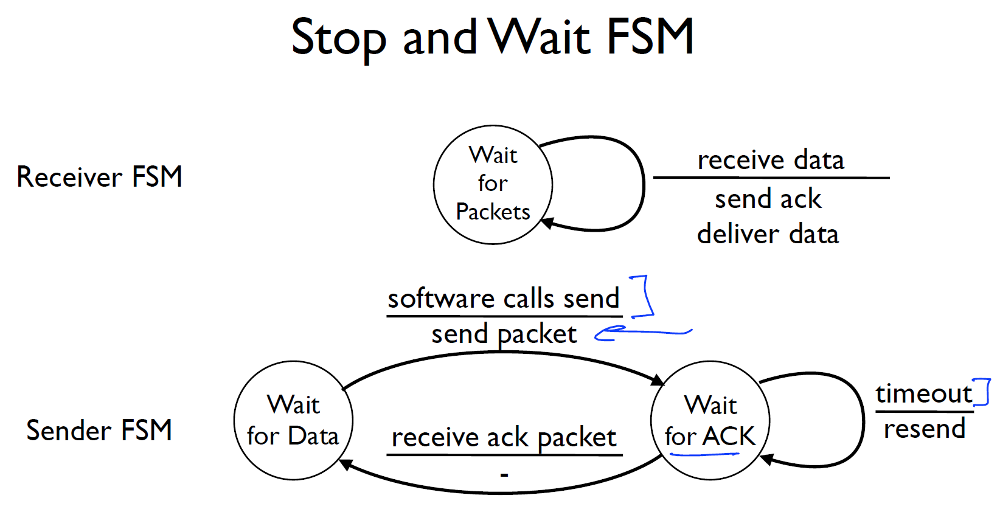

# 2.7  Flow Control


## Flow Control Overview


### The Flow Control Problem
Now that we have the vocabulary of FSMs, we can tackle the central problem this tutorial is about: 

**what happens when a sender is too fast for its receiver?**

This section explains why the problem exists and sets up the two solutions we'll explore.

Imagine you have two computers, A and B, connected by a network. Computer A can generate and send data at 500,000 packets per second. Computer B can only process 200,000 packets per second. A is blazing fast; B is merely quick. If A sends at full speed without any coordination, B will be overwhelmed — it can't process packets fast enough, its buffer fills up, and incoming packets start getting dropped on the floor. Data is lost.

This is the flow control problem: ensuring the sender does not overwhelm the receiver. The receiver needs a way to give the sender feedback about how fast it can cope, and the sender needs to respect that feedback.


Flow control ensures that a sender doesn't overwhelm a receiver by sending data faster than the receiver can process it. 


- Don’t send more packets than receiver can process
- Receiver gives sender feedback
- Two basic approaches
    - Stop and wait (this video)
    - Sliding window (next video)

Two main approaches exist: stop-and-wait and sliding window.

| Approach	| Core Idea	 | Trade-off |
| ----------- | ----------- | --------- |
|Stop-and-Wait	| Send one packet, then pause until the receiver acknowledges it	| Simple & safe, but slow — like having one conversation at a time |
| Sliding Window |	Send multiple packets at once, up to a limit the receiver can handle |	Efficient & fast, but more complex bookkeeping |


The key insight behind both approaches is the same: the receiver gives the sender feedback. The feedback mechanism differs, but the cooperation is essential.

### Two fundamental mechanisms
Reliable delivery is usually accomplished using a combination of two fundamental mechanisms - acknowledgments and timeouts. 

- 1. **Acknowledgments**

An acknowledgment (ACK for short) is a small control frame that a protocol sends back to its peer saying that it has received an earlier frame. By control frame we mean a header without any data, although a protocol can piggyback an ACK on a data frame it just happens to be sending in the opposite direction. The receipt of an acknowledgment indicates to the sender of the original frame that its frame was successfully delivered. If the sender does not receive an acknowledgment after a reasonable amount of time, then it retransmits the original frame. 

- 2. **Timeouts**
  
This action of waiting a reasonable amount of time is called a timeout.


### Flow Control vs. Congestion Control
Important distinction:
Flow control (what we discussed):
- Prevents sender from overwhelming receiver
- Receiver advertises window size based on buffer space
- End-to-end between sender and receiver

Congestion control:

- Prevents sender from overwhelming the network
- Sender adjusts based on network conditions
- TCP includes both mechanisms


## 1. Stop-and-Wait

The idea of stop-and-wait is straightforward: 
After transmitting one frame, the sender waits for an acknowledgment before transmitting the next frame. 
If the acknowledgment does not arrive after a certain period of time, the sender times out and retransmits the original frame.

### Stop and Wait FSM



#### Stop-and-Wait — Sender FSM (pseudocode)

This FSM captures the entire sender logic in two states: WAIT FOR DATA and WAIT FOR ACK. 

when the application call send, the protocol sends a packet with that data, it then enters the WAIT FOR ACK state.

In  this state, there are 2 transitions:
- if the ACK arrives, the protocol enters the WAIT FOR DATA state
- if the timeout expires, the protocol retransmits the packet and remains in the WAIT FOR ACK state

Notice how seqNo = 1 - seqNo flips between 0 and 1 as each new packet is acknowledged — that single bit is the duplicate-detection mechanism.

```c++

// Sender starts in "Wait for Data" state (software has data to send)
state WaitForData:
  on softwareSend(packet):
    sendPacket(packet, seqNo)      // seqNo is 0 or 1
    startTimer()
    goto WaitForACK

state WaitForACK:
  on receiveACK(ackNo):
    if ackNo == seqNo:              // correct ACK?
      seqNo = 1 - seqNo            // flip bit: 0→1, 1→0
      cancelTimer()
      goto WaitForData
  on timeout:
    sendPacket(packet, seqNo)      // retransmit same packet
    restartTimer()

```


#### Stop-and-Wait — Receiver FSM (pseudocode)
The receiver only ever has one state：**WAIT FOR PACKETS**. 
When it receives a packet, it sends an ACK for the packet. if the data is new, it delivers it to the application layer.

Crucially, it sends an ACK even for duplicates — this "heals" the case where the original ACK was lost, preventing the sender from retransmitting forever.

```c++
// Receiver waits for packets, sends ACK, delivers to application
state WaitForPackets:
  on receiveData(packet, seqNo):
    if seqNo == expected:           // new data, not a duplicate
      deliverToApp(packet)
      expected = 1 - expected       // advance expected sequence
    sendACK(seqNo)                  // always ACK, even duplicates
    goto WaitForPackets             // always return to same state
```


### Executions Examples


### Characteristics
Advantages:
- Very simple to implement
- Easy to reason about
- Prevents receiver overload (one packet at a time)

Disadvantages:
- Extremely inefficient - wastes network capacity
- Poor performance - especially on high-latency links
- Sender sits idle waiting for ACKs

### The Duplicate Problem

In both C and D cases, the sender times out and retransmits the original frame, but the receiver will think that it is the next frame, since it correctly received and acknowledged the first frame. Without any way to distinguish between them, it might deliver the same data to the application twice — a serious bug.

The fix is elegant: 
- include **a 1-bit counter** in both data packets and acknowledgments. 
- The sender alternates the counter value between 0 and 1 for each new packet: `0 → 1 → 0 → 1 ...`
- The receiver keeps track of the last correctly received bit,uses this bit to determine whether an incoming packet is fresh new data or a retransmission to discard. 
- If it sees the same bit again → it's a duplicate → discard

This tiny addition solves the duplicate problem completely, under two simplifying assumptions: 
- the network never duplicates packets on its own
- packets are never delayed across multiple timeout intervals.


### The Performance Problem


Round-Trip Time (RTT) kills performance:
Example:
- Bandwidth = 10 Mbps : The bottleneck link can carry 10 Mbps (megabits per second)
- RTT = 100ms
- Packet transmission time = 1ms
- Sender is idle for 99ms out of every 100ms
- Utilization: only 1%!

Utilization Formular
= Acutual Bits sent in the Pipe/Pipe capacity 
= Frame size/ (Bandwidth * RTT)
= Frame size/ Bandwidth * 1/ RTT
= Transmission Time/RTT


The network link sits mostly empty while sender waits.

If packets are 1 KB each, need window of ~125 packets to fully utilize the link.

The problem is the protocol never keeps the "pipe" full. Like a highway where only one car is allowed at a time, most of the road sits empty. This motivates the next protocol.


Optimal window size should match the bandwidth-delay product:
`Optimal Window = Bandwidth × RTT`


## 2. Sliding Window

The Sliding Window protocol is a direct generalization of Stop-and-Wait. Instead of waiting for one ACK before sending the next packet, the sender is allowed to have several packets "in flight" simultaneously — up to a limit called **the window size**. This keeps the network pipe full and dramatically increases throughput. This section covers how the sender and receiver each maintain their own "window" state.


The "window" is the number of packets the sender can have outstanding (unacknowledged) at any time.

Imagine a window that "slides" over a stream of packets to allow:

- Efficient transmission (avoids waiting after every packet)
- Reliable delivery (enables retransmission on loss)
- Flow control (adapts to receiver's capacity)


### Visual Example (Window Size = 4)

Picture a train of numbered packets: 0, 1, 2, 3, 4, 5, 6 … The sender can send any packets within its current "window" — say, packets 0 through 4. As ACKs arrive, the window slides forward: once packet 0 is acknowledged, the window advances to cover packets 1 through 5. It's like a magnifying glass moving along the number line of packets.


```
Sender's Window: [1][2][3][4] _ _ _ _ ...
                  └─ can send these ─┘

Time 0:
Sender: Send packets 1,2,3,4
  |---- Packet 1 ---->|
  |---- Packet 2 ---->|
  |---- Packet 3 ---->|
  |---- Packet 4 ---->|

Time 1: ACK 1 arrives
Window slides: _ [2][3][4][5] _ _ _ ...
Sender: Can now send packet 5
  |---- Packet 5 ---->|

Time 2: ACK 2 arrives  
Window slides: _ _ [3][4][5][6] _ _ ...
Sender: Can now send packet 6
  |---- Packet 6 ---->|

```
### Sender-Side Behavior


- Maintain 3 variables
  - **Send window size (SWS)** :  gives the upper bound on the number of outstanding (unacknowledged) frames that the sender can transmit;
  - **Last acknowledgment received (LAR)**:  the sequence number of the last acknowledgment received
  - **Last segment sent (LSS)**: the sequence number of the last segment sent
- Maintain invariant: `(LSS - LAR) ≤ SWS`

- The sender keeps a window of packets it is allowed to send.
- When an ACK is received, the window slides forward, allowing new data to be sent.
- Every segment has a sequence number (SeqNo)
- Advance LAR on new acknowledgment,  thereby allowing the sender to transmit another frame. 
- Buffer up to SWS segments

In plain English: the gap between the last thing you sent and the last thing acknowledged cannot exceed the window size. When you receive a new ACK, you advance LAR forward, which "opens up" space in the window to send more packets. The sender must also buffer up to SWS packets in memory, because any of them might need to be retransmitted if their ACK never arrives.


Sender logic — enforcing the window invariant

```c++
let SWS = 4        // window size: max 4 unacked packets
let LAR = 0        // last acknowledgment received
let LSS = 0        // last segment sent
let buffer = []   // retransmit buffer

function trySend(packet) {
  if (LSS - LAR < SWS) {       // window has space?
    LSS++
    buffer.push(packet)
    transmit(packet, LSS)
    startTimer(LSS)
  } else {
    waitForAck()              // window full — must wait
  }
}

function onAck(ackNo) {
  LAR = Math.max(LAR, ackNo)  // advance left edge of window
  buffer.removeAcknowledged(ackNo)
  trySend(nextPacket)          // window opened up, try sending
}
```

Each time an ACK arrives, LAR advances and the window "slides" forward, creating room for new packets. The buffer holds all sent-but-not-yet-acknowledged packets, ready for retransmission if a timer fires.


### Receiver-Side Behavior


- Maintain 3 variables
  - **Receive window size (RWS)**: how many out-of-order packets it's willing to buffer. (called receive window), which tells the sender how much buffer space is available.
  - **Last acceptable segment (LAS)**: the highest sequence number it will accept right now.
  - **Last segment received (LSR)**: the most recently received sequence number.
- Maintain invariant: `(LAS - LSR) ≤ RWS`

- If an incoming packet's sequence number < LAS, the receiver accepts it and sends back an acknowledgment. 
- Crucially, TCP uses **cumulative acknowledgments**:
  - if packets 1, 2, 3, and 5 have arrived but not 4, the receiver only acknowledges up to 3. 
  - It won't acknowledge 5 until 4 arrives, because the application needs data delivered in order.
  - In TCP's notation, an ACK of "4" means "I have everything up to and including 3 — please send 4 next."


When a frame with sequence number SeqNum arrives, the receiver takes the following action. 

- If SeqNum <= LFR or SeqNum > LAF, then the frame is outside the receiver’s window and it is discarded. 
- If LFR < SeqNum <= LAF, then the frame is within the receiver’s window and it is accepted. 
  
  Now the receiver needs to decide whether or not to send an ACK. Let **SeqNumToAck** denote the largest sequence number not yet acknowledged, such that all frames with sequence numbers less than or equal to SeqNumToAck have been received. 
  The receiver acknowledges the receipt of SeqNumToAck, even if higher numbered packets have been received. 
  This acknowledgment is said to be **cumulative**. It then sets LFR = SeqNumToAck and adjusts LAF = LFR + RWS.


### Characteristics
Advantages:
- Much more efficient - keeps network busy
- Higher throughput - multiple packets in flight
- Better link utilization - especially on high-latency links
- Adaptable - window size can be adjusted

Complexity:
- More complex to implement
- Need to track multiple packets
- Handle out-of-order delivery
- Manage buffers at both ends

### Examples
- **Bottleneck bandwidth**: 10 Mbps
- **Frame size**: 1.5 KByte = 12 Kbits
- **RTT (Round-Trip Time)**: 50 ms


#### Step-by-Step Calculation
- Step 1: Calculate Transmission Time

**Transmission time** = Time to put one frame onto the wire

```
Transmission Time = Frame Size / Bandwidth
                  = 12 Kbits / 10 Mbps
                  = 12 Kbits / 10,000 Kbps
                  = 0.0012 seconds
                  = 1.2 ms
```

- Step 2: Calculate Total Cycle Time

In stop-and-wait, one complete cycle is:
1. Send the frame (transmission time)
2. Wait for ACK to come back (RTT)

```
Total Cycle Time = Transmission Time + RTT
                 = 1.2 ms + 50 ms
                 = 51.2 ms
```

- Step 3: Calculate Efficiency (Utilization)

**Efficiency** = (Time actually transmitting data) / (Total time per cycle)

```
Efficiency = Transmission Time / Total Cycle Time
           = 1.2 ms / 51.2 ms
           = 0.0234
           = 2.34%
```

Result : **The stop-and-wait efficiency is approximately 2.34%**

This means:
- The link is only busy **2.34%** of the time
- The sender is idle **97.66%** of the time
- We're wasting almost **98%** of the available bandwidth!

#### Visualization

```
Timeline for one packet cycle (51.2 ms total):

[████] Transmitting (1.2 ms - actually using the link)
[----------------------------------------------------] 
                Waiting for ACK (50 ms - IDLE!)

████ = 2.34% utilization
---- = 97.66% wasted capacity
```

#### Actual Throughput

**Effective throughput** with stop-and-wait:

```
Throughput = Frame Size / Total Cycle Time
           = 12 Kbits / 51.2 ms
           = 12 Kbits / 0.0512 s
           = 234.375 Kbps
```

Even though the link can handle **10 Mbps**, we're only achieving **234 Kbps** - about **42 times slower**!

#### How Many Packets Needed in Window?

To fully utilize the 10 Mbps link with sliding window:

```
Bandwidth-Delay Product = Bandwidth × RTT
                        = 10 Mbps × 50 ms
                        = 10 Mbps × 0.05 s
                        = 0.5 Mbits
                        = 500 Kbits
                        = 62.5 KBytes

Window Size Needed = Bandwidth-Delay Product / Frame Size
                   = 500 Kbits / 12 Kbits
                   = 41.67 frames
                   ≈ 42 frames
```

**With a sliding window of 42 packets**, you could achieve close to 100% efficiency instead of 2.34%!

Summary Formula
**Stop-and-Wait Efficiency** = (Transmission Time) / (Transmission Time + RTT)

Or equivalently:

**Efficiency** = 1 / (1 + RTT/Transmission Time)
               = 1 / (1 + 50ms/1.2ms)
               = 1 / (1 + 41.67)
               = 1 / 42.67
               = 2.34%

This clearly shows why stop-and-wait is terrible for networks with non-negligible latency!


### RWS, SWS, and Sequence Space

- RWS ≥ 1, SWS ≥ 1, RWS ≤ SWS
- If RWS = 1, “go back N” protocol, need SWS+1 sequence numbers
- If RWS = SWS, need 2SWS sequence numbers
- Generally need RWS+SWS sequence numbers
  - RWS packets in unknown state (ACK may/may not be lost)
  - SWS packets in flight must not overflow sequence number space

---


## TCP Flow Control in Practice

Everything you've learned so far comes together in TCP — the Transmission Control Protocol that carries the vast majority of internet traffic. This section shows how TCP implements sliding window flow control using a specific field in its packet header, and briefly introduces how the full TCP connection lifecycle is modeled as an FSM.


### The Window Field in TCP Headers


TCP has flow control built directly into its packet format. Every TCP packet carries a **window field** in its header. 
- Receiver advertises RWS using window field
The receiver fills this field with its current RWS — how much more data it can accept — and sends it back to the sender with every acknowledgment. This is called **receiver window advertisement**.

- The sender's rule is simple: it can only send data up to LAR + window. 
If the receiver's window shrinks to zero (its buffer is full), the sender stops transmitting entirely until the window reopens.

Every time the receiver sends an acknowledgment, it also tells the sender: "here's how much more buffer space I have." The sender uses this to dynamically adjust how many bytes it sends. If the receiver's application is consuming data quickly, the window stays large. If the application slows down, the window shrinks, naturally throttling the sender.


### The TCP Connection FSM
TCP connection management — how connections are opened and closed — is one of the most famous FSMs in networking. While a complete walkthrough is beyond this tutorial's scope, the key insight is that the three-way handshake (SYN → SYN/ACK → ACK) is modeled as an FSM with states like CLOSED, LISTEN, SYN_SENT, SYN_RECEIVED, and ESTABLISHED.


TCP 3-way handshake — simplified FSM transitions

```
// Client side (active opener)
CLOSED  → [connect()]  → SYN_SENT    // sends SYN
SYN_SENT → [recv SYN/ACK] → ESTABLISHED // sends ACK

// Server side (passive opener)
CLOSED   → [listen()]    → LISTEN       // no packets sent
LISTEN   → [recv SYN]    → SYN_RECEIVED // sends SYN/ACK
SYN_RECEIVED → [recv ACK] → ESTABLISHED  // connection open!

// Both sides now in ESTABLISHED: data flows freely
```

The FSM makes it precise: calling connect() sends a SYN and moves the socket to SYN_SENT; receiving a SYN/ACK response completes the client side; receiving the final ACK completes the server side. Before FSMs, these rules lived only in prose — ambiguous and error-prone.


### Connection Teardown: The FIN Handshake
Closing a TCP connection is more complex than opening one, because TCP is bidirectional. Either side can "half-close" its direction while still receiving data from the other. When one side calls close(), it sends a FIN packet and enters FIN_WAIT_1. The other side acknowledges and enters CLOSE_WAIT. Both sides eventually exchange FINs and acknowledgments through a sequence of states — FIN_WAIT_2, TIME_WAIT, LAST_ACK — before the connection fully closes.

The TIME_WAIT state deserves a mention: it's a deliberate delay before the socket is fully closed, to ensure any lingering delayed packets from the old connection are flushed from the network before the same port pair could be reused. It typically lasts 2× the maximum segment lifetime (usually around 60 seconds).


# Networking Calculation

## Networking Concepts

### 1. What is RTT (Round-Trip Time)?

**RTT (Round-Trip Time)** is the time it takes for a signal to travel from the sender to the receiver **and back**.

**Components:**
- Time for packet to go from A → B (forward path)
- Time for acknowledgment to come back from B → A (return path)
- Processing delays at both ends (usually negligible)

**Example:**
```
Sender A                    Receiver B
   |                             |
   |------- Packet -------->|    | (25ms)
   |                             |
   |<------ ACK ------------|    | (25ms)
   |                             |
   |<---- RTT = 50ms total ----->|
```

**Real-world examples:**
- Ping within same city: ~1-10 ms
- Cross-country (US): ~50-100 ms
- Intercontinental: ~150-300 ms
- Satellite link: ~500-700 ms

**What affects RTT:**
- Physical distance (speed of light in fiber)
- Number of router hops
- Queuing delays in routers
- Processing time at endpoints

---

### 2. What is Transmission Time?

**Transmission Time** (also called serialization delay) is the time it takes to **put all the bits of a frame/packet onto the wire**.

Think of it like this:
- You have a truck full of boxes (frame with bits)
- Transmission time = how long to **unload all boxes onto the highway**
- NOT how long it takes the truck to reach its destination

**Key point:** This is purely about getting bits from the computer's memory onto the physical link.

**Example:**
```
Computer's memory: [1 0 1 1 0 0 1 0 1 1 ...]  (12,000 bits)
                         ↓ ↓ ↓ ↓
Physical link:     ----[bit][bit][bit]------>
                         ↑
            Time to push all bits out = Transmission Time
```

**What affects Transmission Time:**
- **Frame/packet size** (more bits = longer time)
- **Link bandwidth** (faster link = shorter time)

---

### 3. What is Bandwidth 带宽?

**Bandwidth** is the **capacity** or **rate** at which data can be transmitted over a link. It's measured in bits per second (bps).

**Common units:**
- Kbps (kilobits per second) = 1,000 bps
- Mbps (megabits per second) = 1,000,000 bps
- Gbps (gigabits per second) = 1,000,000,000 bps

**Analogy:** Bandwidth is like the width of a highway:
- Wider highway = more cars can pass per minute
- Higher bandwidth = more bits can pass per second

**Examples:**
- Old dial-up modem: 56 Kbps
- DSL: 1-100 Mbps
- Cable internet: 100-1000 Mbps (1 Gbps)
- Fiber optic: 1-10 Gbps
- Ethernet (common): 10 Mbps, 100 Mbps, 1 Gbps, 10 Gbps

**Important:** Bandwidth is the **capacity**, not the actual usage. A 10 Mbps link can transmit up to 10 million bits per second.

---

## Why Transmission Time = Frame Size / Bandwidth?

Let me explain this with intuition and then mathematically.

### Intuitive Explanation

**Think of it as a rate problem:**

- **Bandwidth** tells you: "I can send X bits per second"
- **Frame Size** tells you: "I have Y bits to send"
- **Transmission Time** answers: "How long to send all Y bits at rate X?"

**Analogy:**
- You have a water pipe that flows at **10 liters per second** (bandwidth)
- You need to pour **50 liters** of water (frame size)
- How long does it take? **50 liters ÷ 10 liters/second = 5 seconds** (transmission time)

### Mathematical Explanation

**Definition of bandwidth:**
```
Bandwidth = Bits transmitted / Time
```

Rearranging to solve for time:
```
Time = Bits transmitted / Bandwidth
```

Therefore:
```
Transmission Time = Frame Size (in bits) / Bandwidth (in bits per second)
```

### Concrete Example

**Given:**
- Frame size = 12,000 bits (12 Kbits)
- Bandwidth = 10,000,000 bits per second (10 Mbps)

**Calculate:**
```
Transmission Time = 12,000 bits / 10,000,000 bits per second
                  = 0.0012 seconds
                  = 1.2 milliseconds
```

**What this means:**
It takes **1.2 ms** to push all 12,000 bits from the computer onto the wire at a rate of 10 million bits per second.

### Step-by-Step Visualization

Imagine bandwidth = 10 Mbps = 10 million bits/second

**In 1 second:**
```
[10,000,000 bits transmitted]
```

**In 0.001 seconds (1 ms):**
```
10,000,000 bits/sec × 0.001 sec = 10,000 bits transmitted
```

**In 1.2 ms (0.0012 seconds):**
```
10,000,000 bits/sec × 0.0012 sec = 12,000 bits transmitted
```

So to transmit 12,000 bits at 10 Mbps takes exactly 1.2 ms!

---

### The Complete Picture

Let's put it all together with a timeline:

```
Time = 0ms:    Sender starts transmitting frame
               [Computer pushes bits onto wire]
               
Time = 1.2ms:  Last bit of frame leaves sender
               [Transmission complete!]
               [Frame traveling through network...]
               
Time = 25ms:   First bit arrives at receiver
               (propagation delay)
               
Time = 26.2ms: Last bit arrives at receiver
               (25ms propagation + 1.2ms for frame to arrive)
               
Time = 26.2ms: Receiver sends ACK
               
Time = 51.2ms: ACK arrives back at sender
               (another 25ms back)
               
Total RTT = 50ms (round trip for signal)
Transmission Time = 1.2ms (time to push frame out)
Total Cycle = 51.2ms (transmission + RTT)
```

---

### Key Distinctions

| Concept | What it measures | Analogy |
|---------|-----------------|---------|
| **Bandwidth** | Capacity/rate of link | Width of highway |
| **Transmission Time** | Time to put bits on wire | Time to unload truck onto highway |
| **Propagation Delay** | Time for signal to travel distance | Time for truck to drive to destination |
| **RTT** | Round-trip time | Time for truck to go there and back |

---

### Common Confusion

**Bandwidth ≠ Speed**

People often say "high bandwidth = fast internet," but it's more nuanced:

- **High bandwidth** = can send lots of data per second (like a wide pipe)
- **Low latency/RTT** = data gets there quickly (like a short pipe)

**Ideal internet:**
- High bandwidth (wide pipe) + Low latency (short pipe)

**Example:**
- Satellite internet: High bandwidth (50 Mbps) but terrible latency (600ms RTT) - feels slow for gaming
- Fiber nearby: High bandwidth (1 Gbps) and low latency (5ms RTT) - feels instant

---

### Summary

**RTT:** Total time for a signal to go from sender → receiver → back to sender

**Transmission Time:** Time to push all bits of a frame onto the wire = Frame Size / Bandwidth

**Bandwidth:** Link capacity (how many bits per second it can carry)

**Formula:**
```
Transmission Time (seconds) = Frame Size (bits) / Bandwidth (bits/second)
```

This is simply a rate calculation: if you can send B bits per second, then F bits takes F/B seconds!


## How To fully utilize the 10 Mbps link with sliding window

### The Core Problem: Keeping the Pipe Full

The goal of sliding window is to **keep the network link busy** while waiting for acknowledgments.

**Think of the network as a physical pipe:**
- The pipe has a certain **width** (bandwidth)
- The pipe has a certain **length** (related to RTT/delay)
- We want to keep the pipe **completely full of data**

---

### What is Bandwidth-Delay Product (BDP)?

**Bandwidth-Delay Product** tells you: **How many bits can be "in flight" (inside the network pipe) at any given moment?**

### Intuitive Understanding

**Question:** While one packet is traveling to the destination and the ACK is coming back, how much data COULD we have sent during that time?

**Answer:** That's the Bandwidth-Delay Product!

### The Formula

```
Bandwidth-Delay Product = Bandwidth × RTT
```

**Why multiply these?**
- **Bandwidth** = bits we can send per second
- **RTT** = time (in seconds) for round trip
- **Bandwidth × Time** = total bits we can send during that time

---

### Step-by-Step Calculation

- Step 1: Understand What Happens During RTT

**During the RTT (50ms), what could we send?**

If the link can transmit at **10 Mbps**, then in **50ms**:

```
Bits sent = Rate × Time
          = 10 Mbps × 50 ms
          = 10 Mbps × 0.05 seconds
          = 10,000,000 bits/sec × 0.05 sec
          = 500,000 bits
          = 500 Kbits
```

**This means:** During the 50ms it takes for a packet to go there and an ACK to come back, we could have sent **500 Kbits** of data!

- Step 2: Convert to Bytes

```
500 Kbits = 500,000 bits
          = 500,000 bits ÷ 8 bits/byte
          = 62,500 bytes
          = 62.5 KBytes
```

- Step 3: How Many Frames Fit?

Each frame is **12 Kbits** (1.5 KBytes). How many frames equal 500 Kbits?

```
Window Size = Bandwidth-Delay Product / Frame Size
            = 500 Kbits / 12 Kbits per frame
            = 41.67 frames
            ≈ 42 frames
```

---

### Visual Explanation: The Pipe Analogy

#### The Network "Pipe"

Imagine the network as a physical pipe:

```
Sender ============[PIPE]============ Receiver
       |<------- 500 Kbits -------->|
```

**Pipe capacity = Bandwidth-Delay Product = 500 Kbits**

This pipe can hold **500 Kbits worth of data** at any instant.

#### Stop-and-Wait (Window = 1)

```
Time 0ms:
Sender: [Frame1]=============================> Receiver
        ↑
    Send 12 Kbits

Time 1.2ms: (frame fully on wire)
Pipe:   ---[Frame1 traveling]----------------> 
            (only 12 Kbits in 500 Kbit pipe!)
            
Sender: [IDLE - waiting for ACK]
        (wasting 488 Kbits of capacity!)

Time 51.2ms: ACK returns
Sender: Can finally send Frame2
```

**Utilization:** 

12 Kbits / 500 Kbits 
= 2.4% of pipe filled
= Acutual Bits sent in the Pipe/Pipe capacity 
= Frame size/ (Bandwidth * RTT)
= Frame size/ Bandwidth * 1/ RTT
= Transmission Time/RTT

#### Sliding Window (Window = 42)

```
Time 0ms: Start sending
Sender: [F1][F2][F3]...[F42]==================> Receiver

Time 50ms: (after filling the pipe)
Pipe: [F1][F2][F3][F4]...[F42] (all in flight!)
      |<---- 42×12 = 504 Kbits ≈ 500 Kbits -->|
      
Sender: Pipe is FULL! ✓
        As ACKs arrive, send new frames
        
ACK for F1 arrives → Send F43
ACK for F2 arrives → Send F44
... (continuous flow)
```

**Utilization:** 500+ Kbits / 500 Kbits ≈ 100% of pipe filled! ✓

---

### Timeline Comparison

#### Stop-and-Wait Timeline

```
Time (ms)  Sender Activity              Bits in Flight
─────────────────────────────────────────────────────────
0          Send Frame1 (12 Kbits)       0
1.2        Frame1 fully on wire          12 Kbits
25         Frame1 arrives at receiver    12 Kbits
26.2       ACK sent back                 12 Kbits
50         [IDLE - waiting]              ~12 Kbits
51.2       ACK arrives                   0
51.2       Send Frame2                   0
52.4       Frame2 fully on wire          12 Kbits
...        (repeat cycle)

Average bits in flight: ~12 Kbits (only 2.4% of capacity!)
```

#### Sliding Window (42 frames) Timeline

```
Time (ms)  Sender Activity              Bits in Flight
─────────────────────────────────────────────────────────
0.0        Send Frame1                   0
1.2        Send Frame2                   12 Kbits
2.4        Send Frame3                   24 Kbits
3.6        Send Frame4                   36 Kbits
...
49.2       Send Frame42                  492 Kbits
50.4       Pipeline FULL                 504 Kbits ✓
51.2       ACK1 arrives, send Frame43    504 Kbits
52.4       ACK2 arrives, send Frame44    504 Kbits
53.6       ACK3 arrives, send Frame45    504 Kbits
...        (steady state - continuous)

Average bits in flight: ~500 Kbits (100% of capacity!) ✓
```

---

### Why Exactly 42 Frames?

We need enough frames to **fill the pipe completely**.

**Pipe capacity:** 500 Kbits
**Each frame:** 12 Kbits

```
Number of frames = Pipe capacity / Frame size
                 = 500 Kbits / 12 Kbits
                 = 41.67 frames
```

Since we can't send 0.67 of a frame, we round up to **42 frames**.

### What This Means

**With 42 frames in the window:**
```
Total data in window = 42 × 12 Kbits = 504 Kbits
```

This is **slightly more** than the 500 Kbit pipe capacity, which means:
- The pipe stays full
- Link is 100% utilized
- Maximum throughput achieved!

**With fewer frames (e.g., 20):**
```
Total data in window = 20 × 12 Kbits = 240 Kbits
Utilization = 240 / 500 = 48% (wasted capacity!)
```

**With more frames (e.g., 100):**
```
Total data in window = 100 × 12 Kbits = 1200 Kbits
Still good! But requires more buffers, no additional benefit
```

---

### The Physical Interpretation

#### What's Actually Happening

At any given instant with a 42-frame window:

```
Network State Snapshot:

[Sender]--[frames in flight]--[Receiver]
          |                  |
          |  F1 F2 F3 ... F42|  (traveling)
          |                  |
          |<-- 500 Kbits --->|
          
[Sender Buffer]
F43, F44, F45... (ready to send when ACKs arrive)

[Receiver Buffer]  
F1, F2, F3... (already received, sending ACKs back)

[ACKs in flight]
ACK1, ACK2, ACK3... (traveling back to sender)
```

**The "pipe" is full:**
- 42 frames traveling forward (≈500 Kbits)
- ACKs traveling backward
- As ACKs arrive, new frames immediately sent
- **Continuous flow, no idle time!**

---

### Throughput Calculation

#### Stop-and-Wait Throughput

```
Throughput = Frame Size / (Transmission Time + RTT)
           = 12 Kbits / 51.2 ms
           = 12 Kbits / 0.0512 sec
           = 234 Kbps

Efficiency = 234 Kbps / 10 Mbps = 2.34%
```

#### Sliding Window (42 frames) Throughput

```
Throughput = (Frames in Window × Frame Size) / RTT
           = (42 × 12 Kbits) / 50 ms
           = 504 Kbits / 0.05 sec
           = 10,080 Kbps
           ≈ 10 Mbps ✓

Efficiency = 10 Mbps / 10 Mbps ≈ 100% ✓
```

---

### General Formula

For **any** network scenario:

- Step 1: Calculate Bandwidth-Delay Product
```
BDP (bits) = Bandwidth (bps) × RTT (seconds)
```

- Step 2: Calculate Window Size
```
Window Size (frames) = BDP (bits) / Frame Size (bits)
```

### Real-World Examples

**Example 1: Fast local network**
- Bandwidth = 1 Gbps
- RTT = 1 ms
- Frame size = 1500 bytes = 12,000 bits

```
BDP = 1,000,000,000 bps × 0.001 sec = 1,000,000 bits
Window = 1,000,000 / 12,000 = 83.3 ≈ 84 frames
```

**Example 2: Satellite link**
- Bandwidth = 50 Mbps  
- RTT = 600 ms
- Frame size = 1500 bytes = 12,000 bits

```
BDP = 50,000,000 bps × 0.6 sec = 30,000,000 bits
Window = 30,000,000 / 12,000 = 2,500 frames (!!)
```

This is why satellite links need **huge** windows!

---

### Summary

**Bandwidth-Delay Product** = Amount of data that can be "in flight" in the network

```
BDP = Bandwidth × RTT
```

**Window Size Needed** = How many frames to fill that capacity

```
Window Size = BDP / Frame Size
            = (Bandwidth × RTT) / Frame Size
```

**For your example:**
- 10 Mbps × 50 ms = 500 Kbits capacity
- 500 Kbits ÷ 12 Kbits/frame = 42 frames needed
- **With 42 frames, the link is 100% utilized!**
- **With 1 frame (stop-and-wait), only 2.34% utilized**

The sliding window of 42 frames keeps the network "pipe" completely full, maximizing throughput and efficiency!


